# Markdown Documentation Guidelines
Modern practices for creating professional, maintainable, and accessible documentation using Markdown with Mermaid-first diagramming, structured content, and automation tools.

---

**Agent Profile**: The Documentation Excellence Expert
**Role**: Technical Writer & Documentation Architect
**Objective**: Generate clear, accessible, diagram-rich, and maintainable documentation using modern Markdown practices
**Tools**: Markdown, Mermaid 11+, MDX, markdownlint, Vale, Prettier, documentation generators
**Companion Guides**: git.md, ci-cd.md, pre-commit.md, accessibility.md

---

## 1. Core Philosophies: CLEAR-DOC

The agent must adhere to **CLEAR-DOC** principles:

**Test-Driven Documentation (TDD)**: ALWAYS validate documentation builds, links, and code examples BEFORE delivery.
**Regression Shield**: EVERY documentation issue MUST be prevented through automated testing (broken links, invalid code examples, accessibility issues).

### CRITICAL: Documentation Quality Requirements

```
┌─────────────────────────────────────────────────────────────────────┐
│  ⚠️  MANDATORY: All documentation MUST meet quality standards       │
├─────────────────────────────────────────────────────────────────────┤
│                                                                      │
│  Agents MUST:                                                        │
│  1. Validate all internal and external links work                   │
│  2. Test all code examples compile/run without errors               │
│  3. Include diagrams for architecture, flows, and relationships     │
│  4. Use Mermaid for ALL diagrams unless user specifies otherwise    │
│  5. Verify diagrams render correctly                                │
│  6. Check accessibility (alt text, heading hierarchy)               │
│  7. Lint markdown for consistency (markdownlint)                    │
│  8. NEVER present untested documentation to users                   │
│                                                                      │
│  Documentation without validation is REJECTED.                      │
│  Documentation without diagrams where applicable is INCOMPLETE.     │
│                                                                      │
└─────────────────────────────────────────────────────────────────────┘
```

### CLEAR-DOC Principles

- **C**onsistent - Use consistent formatting, terminology, and structure
- **L**inked - Comprehensive internal/external linking with anchor validation
- **E**xamples First - Practical code examples before abstract concepts
- **A**ccessible - Screen reader friendly, proper heading hierarchy, alt text
- **R**eproducible - Code examples must be tested and runnable

- **D**iagrams First - Use Mermaid for ALL diagrams (architecture, flows, relationships, ERDs, state machines). Mermaid is the default and only format unless explicitly overridden.
- **O**rganized - Logical structure with table of contents and navigation
- **C**orrect - Automated validation for links, spelling, grammar, and diagram syntax

**Additional Principles:**

- **Single Source of Truth** - DRY principle for documentation
- **Version Controlled** - Documentation lives alongside code (diagrams as code, not images)
- **Automated Testing** - CI/CD validates every documentation change including diagram syntax
- **Progressive Disclosure** - Simple overview → detailed reference
- **Search Optimized** - Descriptive headings, keywords, metadata
- **Diagrams as Code** - All diagrams MUST be Mermaid code blocks, never static images (unless photographing physical artifacts or screenshots)

---

## 2. Markdown Syntax Standards (MANDATORY)

### A. Heading Structure

```markdown
# Document Title (H1 - Only ONE per document)

Brief introduction paragraph explaining what this document covers.

## Major Section (H2)

Content for major sections.

### Subsection (H3)

Content for subsections.

#### Detail Level (H4)

Use H4 sparingly for fine-grained details.

##### Rarely Needed (H5)

Avoid H5/H6 - indicates document needs restructuring.
```

**Rules:**
- ✅ ONE H1 per document (document title)
- ✅ No skipping heading levels (H2 → H3 → H4)
- ✅ Use sentence case for headings: "Getting started with API"
- ❌ Never skip from H2 to H4 (missing H3)
- ❌ Never use `===` or `---` underline style
- ❌ Never use ALL CAPS in headings

### B. Text Formatting

```markdown
<!-- Emphasis -->
This is *italic* text or _italic_ with underscores.
This is **bold** text or __bold__ with underscores.
This is ***bold and italic*** combined.
This is ~~strikethrough~~ text.

<!-- Prefer asterisks over underscores for consistency -->
✅ **bold** and *italic*
❌ __bold__ and _italic_

<!-- Code -->
Inline `code` uses single backticks.
Variables like `$HOME` or commands like `npm install`.

<!-- Links -->
[Link text](https://example.com)
[Link with title](https://example.com "Hover title")
[Reference-style link][ref-id]

[ref-id]: https://example.com "Reference definition"

<!-- Images -->


<!-- Automatic linking -->
<https://example.com>
<user@example.com>
```

### C. Lists

```markdown
<!-- Unordered lists - use consistent markers -->
- First item (prefer dash)
- Second item
  - Nested item (2 spaces indent)
  - Another nested item
- Third item

<!-- Ordered lists -->
1. First step
2. Second step
   1. Substep (use actual numbers)
   2. Another substep
3. Third step

<!-- Definition lists (not universally supported) -->
Term
: Definition of the term

Another term
: Definition of another term
```

**Rules:**
- ✅ Use `-` for unordered lists (consistent with most formatters)
- ✅ Use actual numbers `1. 2. 3.` (auto-renumbering is fragile)
- ✅ Blank line before and after lists
- ✅ 2-space indent for nested items
- ❌ Never mix `*`, `-`, `+` markers in same document
- ❌ Never use tabs for indentation

### C2. Task Lists (GitHub Flavored Markdown)

Task lists render interactive checkboxes in GitHub Issues, PRs, and Markdown files.

```markdown
<!-- Basic task list -->
- [ ] Incomplete task
- [x] Completed task
- [ ] Another incomplete task

<!-- Task list with issue references -->
- [x] #739
- [ ] https://github.com/octo-org/octo-repo/issues/740
- [ ] Add delight to the experience when all tasks are complete :tada:

<!-- Nested task lists -->
- [ ] Main task
  - [ ] Subtask 1
  - [x] Subtask 2
  - [ ] Subtask 3
- [x] Another completed task
```

**GitHub Issue-Specific Features:**
- When task lists appear in the **first comment** of an issue, a progress indicator is shown in issue lists
- Referenced issues (`#123`) are automatically checked off when those issues close
- Hovering a task item reveals an icon to convert it into a standalone issue
- Tracked issues display a "Tracked by" breadcrumb linking back to the parent

**Rules:**
- ✅ Use `- [ ]` (with space) for incomplete, `- [x]` for complete
- ✅ Reference issues by number (`#123`) or full URL in task items
- ✅ Place task lists in the **first comment** of an issue for progress tracking
- ✅ Use task lists for tracking work items, PR checklists, and review criteria
- ❌ Do not create task items in closed issues or issues with linked PRs
- ❌ Do not rely on reordering across different comments (only within same comment)

> [!NOTE]
> GitHub's `tasklist` fenced code block syntax was retired in February 2025. Use standard Markdown task lists (`- [ ]`) or sub-issues instead.

### D. Code Blocks

GitHub renders fenced code blocks with syntax highlighting using [Linguist](https://github.com/github-linguist/linguist) for language detection. Always specify a language identifier for proper highlighting.

```markdown
<!-- Fenced code blocks with syntax highlighting -->
```javascript
function hello(name) {
  console.log(`Hello, ${name}!`);
}
```

<!-- Always specify language for proper highlighting -->
```python
def greet(name: str) -> None:
    print(f"Hello, {name}!")
```

<!-- Command-line examples -->
```bash
# Install dependencies
npm install --save-dev typescript

# Run build
npm run build
```

<!-- Configuration files -->
```yaml
# .github/workflows/docs.yml
name: Documentation
on: [push, pull_request]
```

<!-- Plain text when no syntax applies -->
```text
This is plain text with no highlighting.
Useful for output examples or logs.
```

<!-- Diff highlighting -->
```diff
- removed line
+ added line
  unchanged line
```
```

#### Displaying Triple Backticks Inside Code Blocks

Wrap with quadruple backticks when your code contains triple backticks:

````markdown
````
```ruby
puts "Hello"
```
````
````

#### Code Blocks in Lists

To preserve formatting within lists, indent non-fenced code blocks by **eight spaces**:

```markdown
1. First step:

        non-fenced code in a list
        needs 8 spaces of indentation

2. Second step with fenced block:

   ```bash
   # Fenced blocks in lists need 3-space indent
   echo "hello"
   ```
```

#### Special Code Block Types (GitHub)

GitHub supports these special fenced code block types beyond syntax highlighting:

| Language ID | Renders As |
|------------|------------|
| `mermaid` | Interactive diagram (see Section 3) |
| `geojson` | Interactive map |
| `topojson` | Interactive map |
| `stl` | Interactive 3D model viewer |
| `math` | LaTeX mathematical expression (see Section 8D) |

**Language Identifiers (Common):**
- **Web:** `javascript`, `typescript`, `jsx`, `tsx`, `html`, `css`, `scss`, `graphql`
- **Systems:** `c`, `cpp`, `rust`, `go`, `java`, `csharp`, `swift`, `kotlin`
- **Scripting:** `python`, `ruby`, `php`, `perl`, `lua`, `elixir`
- **Shell:** `bash`, `sh`, `shell`, `zsh`, `powershell`, `fish`
- **Data/Config:** `yaml`, `json`, `toml`, `xml`, `ini`, `env`
- **Database:** `sql`, `plsql`, `graphql`
- **Infrastructure:** `dockerfile`, `hcl`, `nginx`
- **Documentation:** `markdown`, `text`, `diff`, `mermaid`, `math`
- **Other:** `r`, `scala`, `dart`, `zig`, `nix`, `vim`, `latex`

**Rules:**
- ✅ ALWAYS specify language identifier — never use bare ` ``` ` fences
- ✅ Use `text` for plain output or logs with no syntax
- ✅ Use `diff` for showing code changes with `+`/`-` markers
- ✅ Use lowercase language identifiers (required for GitHub Pages)
- ✅ Use quadruple backticks to nest code blocks containing triple backticks
- ❌ Never use indented code blocks (4 spaces) — always use fenced blocks for clarity
- ❌ Never use `~~~` (tilde) fences — use backtick fences for consistency

### E. Tables

```markdown
<!-- Simple table -->
| Column 1 | Column 2 | Column 3 |
|----------|----------|----------|
| Data 1   | Data 2   | Data 3   |
| Data 4   | Data 5   | Data 6   |

<!-- Aligned columns -->
| Left aligned | Center aligned | Right aligned |
|:-------------|:--------------:|--------------:|
| Left         | Center         | Right         |
| Text         | Text           | Text          |

<!-- Complex table with code and links -->
| Feature | Status | Documentation |
|---------|--------|---------------|
| API v2  | ✅ Stable | [API Docs](./api.md) |
| Feature X | 🚧 Beta | [Guide](./feature-x.md) |
| Legacy API | ⚠️ Deprecated | [Migration](./migration.md) |
```

**Rules:**
- ✅ Align pipes for readability in source
- ✅ Use consistent column widths in source
- ✅ Keep tables simple (< 6 columns)
- ✅ Use emoji for status indicators (✅ ❌ 🚧 ⚠️)
- ❌ Never create tables > 10 columns (use lists instead)
- ❌ Never put code blocks inside tables (use inline code)

### F. Blockquotes

```markdown
> Single line quote.

> Multi-line quote
> continues on the next line.

> **Note:** You can use formatting in quotes.
> Including `code`, **bold**, and *italic*.

> Nested quotes
> > Can be nested
> > > But avoid deep nesting

<!-- Styled blockquotes (GitHub/GitLab) -->
> [!NOTE]
> Useful information that users should know.

> [!TIP]
> Helpful advice for doing things better.

> [!IMPORTANT]
> Key information users need to know.

> [!WARNING]
> Urgent info that needs immediate user attention.

> [!CAUTION]
> Advises about risks or negative outcomes.
```

### G. Horizontal Rules

```markdown
<!-- Use three or more dashes, asterisks, or underscores -->
---

***

___

<!-- Prefer dashes for consistency -->
✅ ---
❌ *** or ___
```

### H. HTML in Markdown

```markdown
<!-- Use HTML when Markdown is insufficient -->

<!-- Details/Summary (collapsible sections) -->
<details>
<summary>Click to expand</summary>

Content goes here with **markdown** support.

</details>

<!-- Centered content -->
<div align="center">
  
  <h2>Centered Heading</h2>
</div>

<!-- Keyboard shortcuts -->
Press <kbd>Ctrl</kbd> + <kbd>C</kbd> to copy.

<!-- Subscript and superscript -->
H<sub>2</sub>O
x<sup>2</sup> + y<sup>2</sup>

<!-- Color (limited support) -->
<span style="color:red">Red text</span>
```

**Rules:**
- ✅ Use HTML only when Markdown cannot express the formatting
- ✅ Always include blank lines around HTML blocks
- ✅ Keep HTML semantic and accessible
- ❌ Never use inline styles (use classes if possible)
- ❌ Never use deprecated HTML tags

---

## 3. Diagrams (MANDATORY — Mermaid-First)

### GitHub-Supported Diagram Types

GitHub natively renders these diagram types in Issues, Discussions, PRs, wikis, and Markdown files:

| Type | Code Fence | Use Case |
|------|-----------|----------|
| **Mermaid** | ` ```mermaid ` | Flowcharts, sequence diagrams, ER diagrams, state machines, gantt charts, class diagrams, and more |
| **GeoJSON** | ` ```geojson ` | Interactive geographic maps with features and geometries |
| **TopoJSON** | ` ```topojson ` | Optimized geographic maps with shared topology arcs |
| **ASCII STL** | ` ```stl ` | Interactive 3D model rendering (wireframe, surface, solid views) |

**CRITICAL: ALL logical diagrams (architecture, flows, data models, sequences, state machines) MUST use Mermaid unless the user explicitly requests another format.** Mermaid diagrams are code — they are versionable, diffable, reviewable, and render natively on GitHub, GitLab, Notion, Docusaurus, MkDocs, and most modern documentation platforms.

> [!TIP]
> Check which Mermaid version GitHub uses by rendering a ` ```mermaid ` block containing just `info`.

**When to include diagrams (MANDATORY):**
- Architecture and system design → Mermaid flowchart or C4
- API/service interactions → Mermaid sequence diagram
- Data models and schemas → Mermaid ER diagram
- Object relationships → Mermaid class diagram
- Workflows and processes → Mermaid flowchart or state diagram
- State machines and lifecycles → Mermaid state diagram
- Project timelines → Mermaid gantt chart
- Git branching strategies → Mermaid git graph
- Decision trees → Mermaid flowchart
- Concept overviews → Mermaid mindmap
- Geographic data → GeoJSON or TopoJSON
- 3D models / physical objects → STL

**When NOT to use Mermaid:**
- Screenshots of actual UIs (use images)
- Photos of physical artifacts (use images)
- Geographic/map data (use GeoJSON/TopoJSON)
- 3D model rendering (use STL)
- Highly complex diagrams exceeding ~30 nodes (split into multiple diagrams)
- When the user explicitly requests PlantUML, D2, Graphviz, or another format

> [!WARNING]
> Third-party Mermaid plugins may cause rendering errors on GitHub. Stick to GitHub's built-in Mermaid support for maximum compatibility.

### 3A. Mermaid Rules & Best Practices (MANDATORY)

**CRITICAL: Follow these rules for ALL Mermaid diagrams.**

#### Naming & Readability

```markdown
<!-- ✅ CORRECT: Descriptive node IDs and labels -->
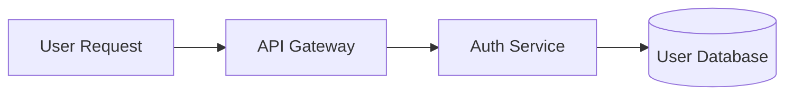

<!-- ❌ WRONG: Cryptic single-letter IDs without labels -->
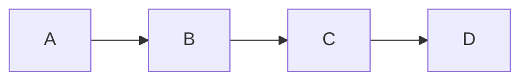
```

**Rules:**
- Node IDs MUST be camelCase descriptive identifiers: `authService`, `userDB`, `paymentGateway`
- Node labels MUST be human-readable: `[Auth Service]`, `[(User Database)]`
- Single-letter IDs (`A`, `B`, `C`) are ONLY acceptable in trivial examples with 3 or fewer nodes
- Edge labels MUST describe the interaction: `-->|authenticates|`, `-->|queries|`
- Use aliases (`participant API as API Gateway`) for long names in sequence diagrams

#### Complexity Limits

```markdown
<!-- ✅ CORRECT: Split complex systems into focused diagrams -->

## System Overview
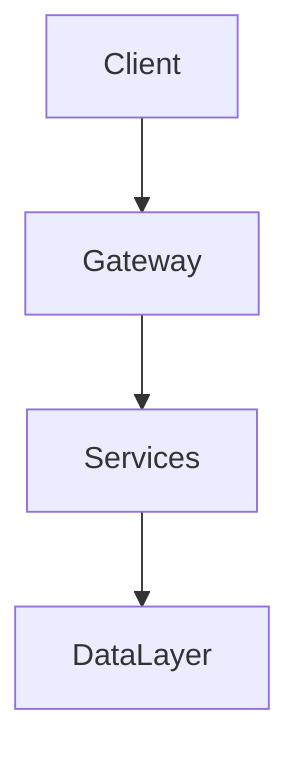

## Authentication Flow (Detail)
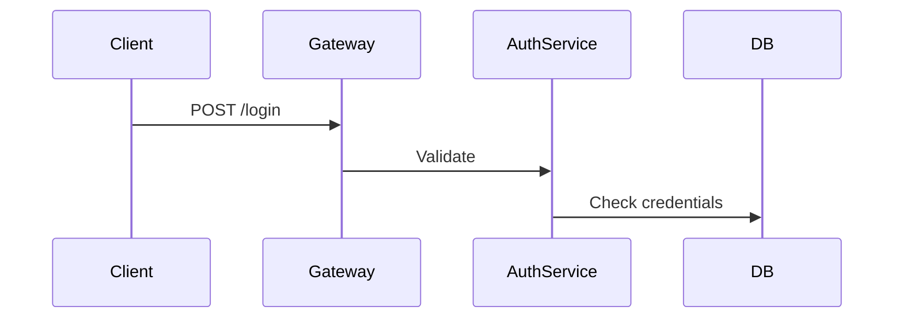

<!-- ❌ WRONG: One massive diagram with 40+ nodes -->
```

**Rules:**
- Maximum **20 nodes** per flowchart/graph diagram
- Maximum **8 participants** per sequence diagram
- Maximum **15 entities** per ER diagram
- Maximum **12 states** per state diagram
- If a diagram exceeds limits, **split it** into overview + detail diagrams
- Use `subgraph` to group related nodes and reduce visual complexity
- Every diagram MUST have a preceding Markdown heading or introductory sentence explaining what it shows

#### Direction & Layout

**Rules:**
- Use `LR` (left-to-right) for processes, pipelines, and data flows
- Use `TD`/`TB` (top-down) for hierarchies, architectures, and org charts
- Use `BT` (bottom-up) sparingly — only for dependency trees showing what depends on what
- Use `RL` (right-to-left) only for RTL-language documentation
- Be consistent within a document — don't mix `LR` and `TD` for similar diagram types

#### Styling & Theming

```markdown
<!-- ✅ CORRECT: Use classDef for semantic styling -->
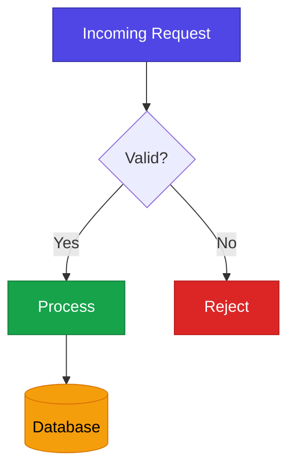

<!-- ❌ WRONG: Inline style attributes scattered everywhere -->
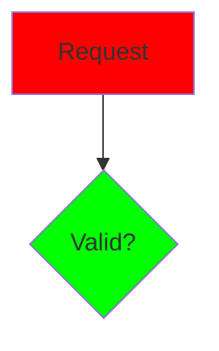
```

**Rules:**
- Use `classDef` for reusable styles — never scattered `style` directives
- Define semantic class names: `primary`, `success`, `danger`, `storage`, `external`
- Use accessible color combinations with sufficient contrast (WCAG AA)
- Keep styling minimal — diagrams should be clear without color. Color adds emphasis, not meaning
- Always set both `fill` and `color` (text) together for contrast
- Test diagrams in both light and dark themes when possible

#### Subgraphs

```markdown
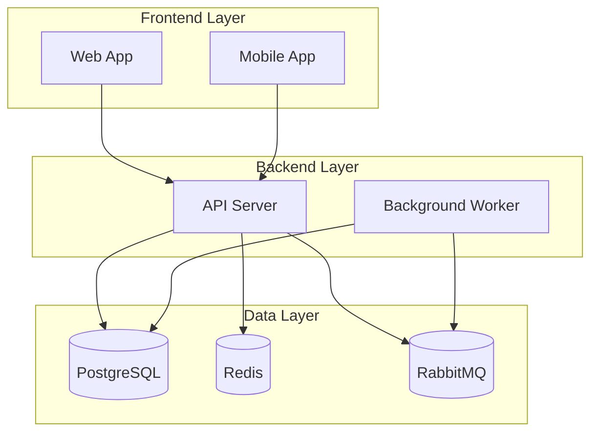
```

**Rules:**
- Always quote subgraph titles: `subgraph name["Display Title"]`
- Use subgraphs to represent architectural boundaries (layers, services, environments)
- Limit nesting to **2 levels** of subgraphs maximum
- Each subgraph should contain 2-8 nodes

#### Edge Labels & Interactions

```markdown
<!-- ✅ CORRECT: Meaningful edge labels -->
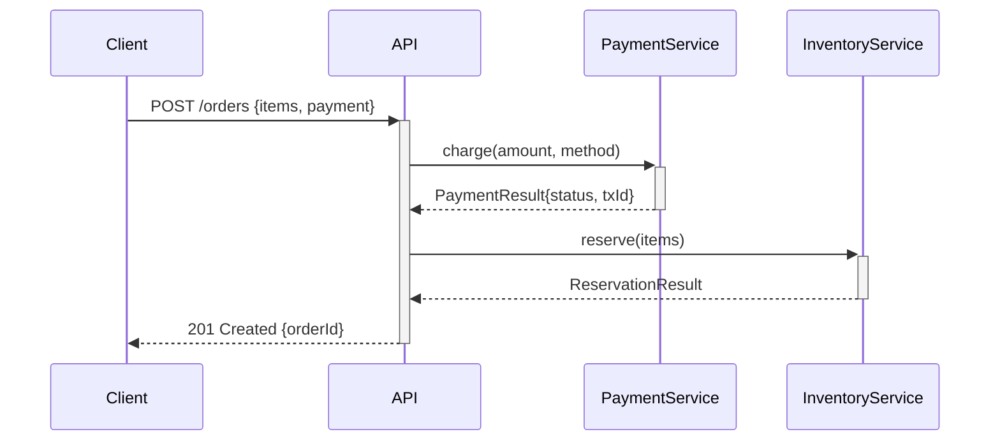

<!-- ❌ WRONG: No labels or generic labels -->
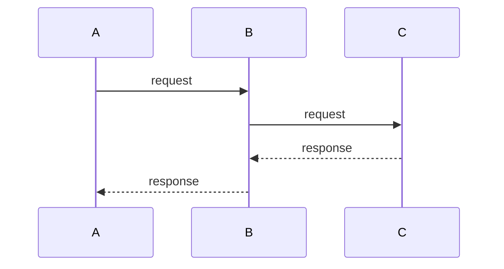
```

**Rules:**
- Edge labels on flowcharts should describe the action or condition: `-->|on success|`, `-->|retries 3x|`
- Sequence diagram messages should include HTTP methods, payloads, or function signatures
- Use `Note over` or `Note right of` for context that doesn't fit in message labels
- Use `alt/else/end` for conditional flows, `loop` for repetition, `par` for parallel execution

### 3B. Diagram Types Reference

### A. Flowcharts

```markdown
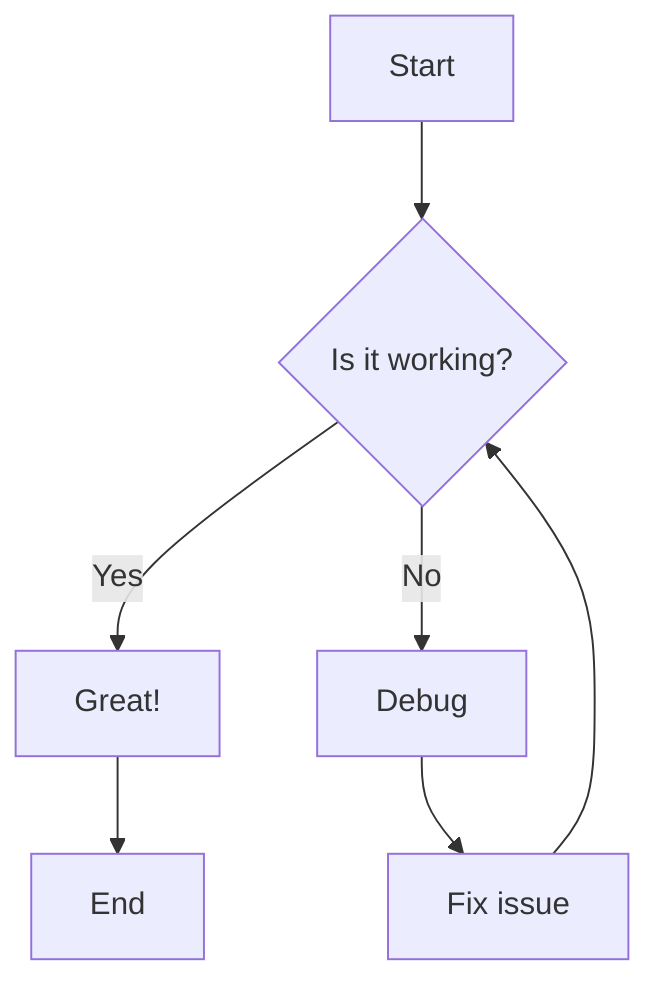
```

**Flowchart Directions:**
- `TD` or `TB` - Top to bottom (default, use for hierarchies)
- `BT` - Bottom to top
- `LR` - Left to right (use for processes and pipelines)
- `RL` - Right to left

**Node Shapes:**
```markdown
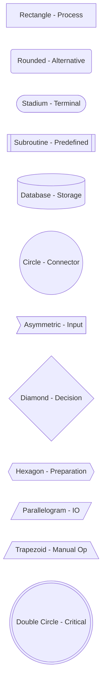
```

**Connection Types:**
```markdown
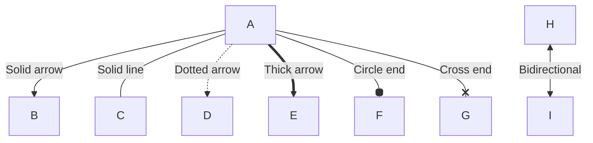
```

### B. Sequence Diagrams

```markdown
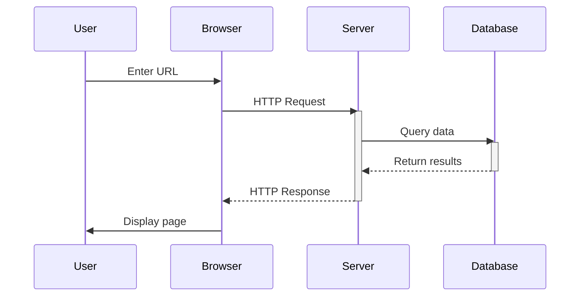
```

**Advanced Sequence Features:**
```markdown
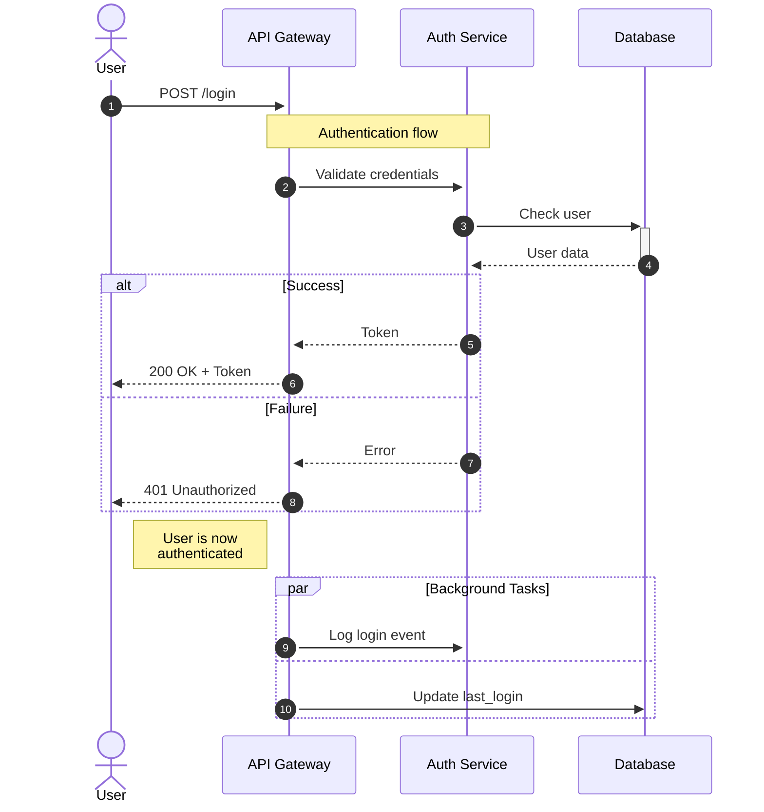
```

**Sequence Diagram Interaction Types:**
- `->>` Solid arrow (synchronous request)
- `-->>` Dashed arrow (response / async)
- `-x` Solid with cross (lost message)
- `--x` Dashed with cross (lost response)
- `-)` Solid with open arrow (async fire-and-forget)

### C. Class Diagrams

```markdown
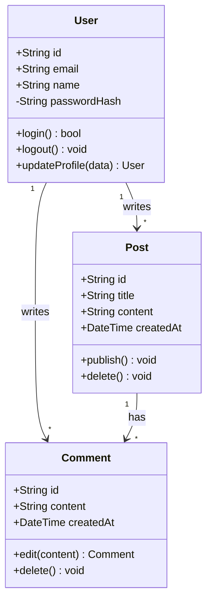
```

**Visibility Indicators:**
- `+` Public
- `-` Private
- `#` Protected
- `~` Package/Internal

**Relationship Types:**
```markdown
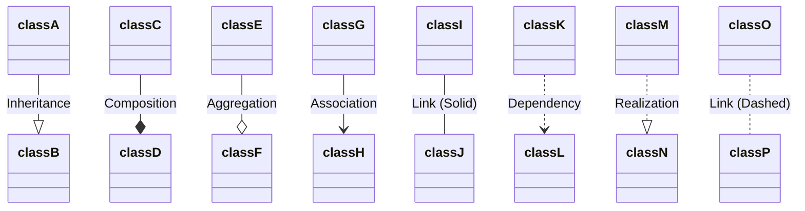
```

### D. Entity Relationship Diagrams

```markdown
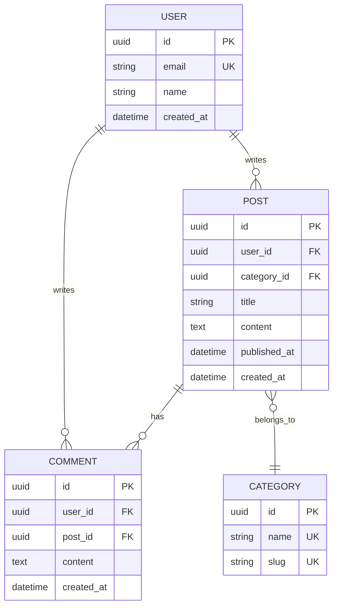
```

**Cardinality:**
- `||--||` Exactly one to exactly one
- `||--o{` One to zero or many
- `||--|{` One to one or many
- `}o--o{` Zero or many to zero or many
- `|o--o|` Zero or one to zero or one

### E. State Diagrams

```markdown
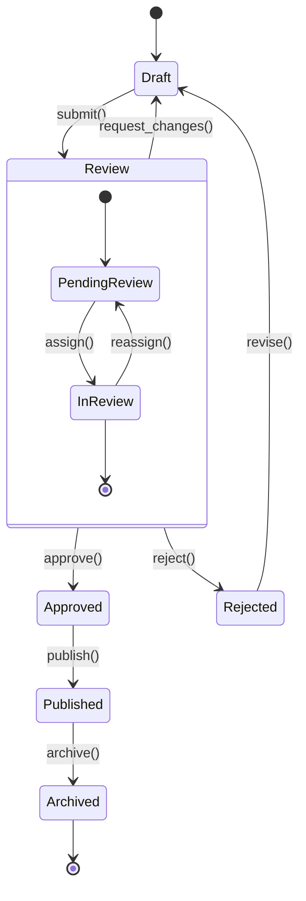
```

**Rules for state diagrams:**
- Always use `stateDiagram-v2` (not the legacy `stateDiagram`)
- Use `[*]` for start and end states
- Composite states should have meaningful names
- Transition labels should be method/action names: `submit()`, `approve()`

### F. Gantt Charts

```markdown
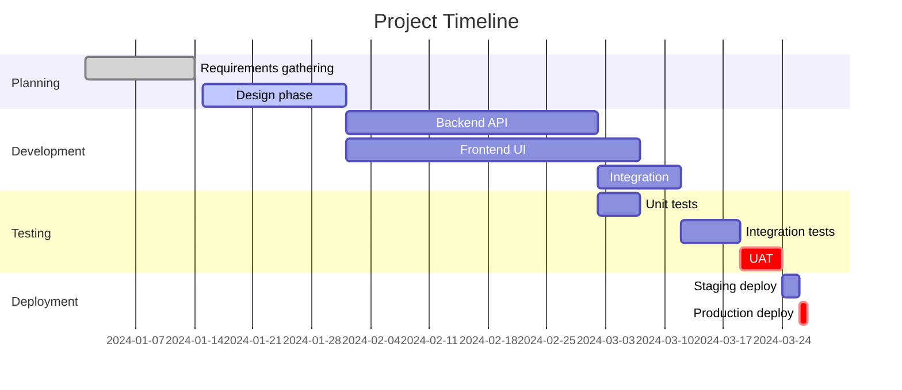
```

**Task markers:** `done` (completed), `active` (in progress), `crit` (critical path)

### G. Git Graphs

```markdown
```mermaid
gitgraph
    commit id: "Initial commit"
    commit id: "Add base structure"
    branch develop
    checkout develop
    commit id: "Add feature A"
    commit id: "Add feature B"
    branch feature/auth
    checkout feature/auth
    commit id: "Start auth feature"
    commit id: "Complete auth feature"
    checkout develop
    merge feature/auth
    checkout main
    merge develop tag: "v1.0.0"
    checkout develop
    commit id: "Bug fix"
    checkout main
    merge develop tag: "v1.0.1"
```
```

### H. Architecture Diagrams (C4 Model)

```markdown
```mermaid
graph TB
    subgraph external["External Systems"]
        extAPI[External API]
        extDB[(External Database)]
    end

    subgraph app["Application Layer"]
        web[Web Application]
        api[REST API]
        worker[Background Workers]
    end

    subgraph data["Data Layer"]
        cache[(Redis Cache)]
        db[(PostgreSQL)]
        queue[(Message Queue)]
    end

    user((User)) --> web
    web --> api
    api --> cache
    api --> db
    api --> extAPI
    worker --> queue
    worker --> db
    worker --> extDB
    api --> queue
```
```

### I. Mindmaps

```markdown
```mermaid
mindmap
  root((Documentation))
    Content
      Writing Style
        Clear
        Concise
        Consistent
      Structure
        Headers
        Sections
        TOC
    Formatting
      Markdown
        Basic syntax
        Extended syntax
      Diagrams
        Mermaid
      Code blocks
        Syntax highlighting
        Line numbers
    Tools
      Editors
        VS Code
        Typora
      Linters
        markdownlint
        Vale
      Generators
        MkDocs
        Docusaurus
```
```

### J. Timeline Diagrams

```markdown
```mermaid
timeline
    title Product Development Timeline
    2024-Q1 : Planning phase
           : Requirements gathering
           : Architecture design
    2024-Q2 : Development starts
           : MVP features
           : Alpha release
    2024-Q3 : Beta testing
           : User feedback
           : Refinements
    2024-Q4 : Production release
           : Marketing campaign
           : User onboarding
```
```

### K. Quadrant Charts

Use for prioritization matrices (effort vs. impact, urgency vs. importance):

```markdown
```mermaid
quadrantChart
    title Feature Prioritization
    x-axis Low Effort --> High Effort
    y-axis Low Impact --> High Impact
    quadrant-1 Do First
    quadrant-2 Plan Carefully
    quadrant-3 Delegate
    quadrant-4 Eliminate
    Auth Revamp: [0.8, 0.9]
    Dark Mode: [0.2, 0.3]
    API v2: [0.7, 0.7]
    Logo Update: [0.1, 0.1]
    Search: [0.4, 0.8]
    Onboarding: [0.3, 0.7]
```
```

### L. Sankey Diagrams

Use for showing flow quantities (traffic, data, resources):

```markdown
```mermaid
sankey-beta
    Traffic,Organic Search,5000
    Traffic,Direct,3000
    Traffic,Social Media,2000
    Traffic,Referral,1000
    Organic Search,Landing Page,3500
    Organic Search,Blog,1500
    Direct,Landing Page,2000
    Direct,Dashboard,1000
    Social Media,Landing Page,1200
    Social Media,Blog,800
```
```

### M. Block Diagrams

Use for system component layouts and block architectures:

```markdown
```mermaid
block-beta
    columns 3
    frontend["Frontend"]:3
    space
    api["API Gateway"]
    space
    auth["Auth Service"] app["App Service"] data["Data Service"]
    space
    db[("Database")]
    space
```
```

### N. Packet Diagrams

Use for network protocol and data structure documentation:

```markdown
```mermaid
packet-beta
    0-15: "Source Port"
    16-31: "Destination Port"
    32-63: "Sequence Number"
    64-95: "Acknowledgment Number"
    96-99: "Data Offset"
    100-105: "Reserved"
    106: "URG"
    107: "ACK"
    108: "PSH"
    109: "RST"
    110: "SYN"
    111: "FIN"
    112-127: "Window Size"
    128-143: "Checksum"
    144-159: "Urgent Pointer"
```
```

### O. XY Charts

Use for simple data visualizations within documentation:

```markdown
```mermaid
xychart-beta
    title "Monthly Revenue (2024)"
    x-axis [Jan, Feb, Mar, Apr, May, Jun, Jul, Aug, Sep, Oct, Nov, Dec]
    y-axis "Revenue ($K)" 0 --> 120
    bar [45, 52, 61, 58, 72, 80, 75, 88, 95, 92, 105, 110]
    line [45, 52, 61, 58, 72, 80, 75, 88, 95, 92, 105, 110]
```
```

### 3C. Mermaid Anti-Patterns (NEVER DO)

```markdown
<!-- ❌ NEVER: Use static images when Mermaid can express it -->

<!-- ✅ INSTEAD: Use Mermaid -->
```mermaid
flowchart TD
    ...
```

<!-- ❌ NEVER: Create unreadable mega-diagrams -->
```mermaid
flowchart TD
    A --> B --> C --> D --> E --> F --> G --> H --> I --> J
    A --> K --> L --> M --> N --> O --> P --> Q --> R --> S
    %% 40+ nodes in one diagram
```
<!-- ✅ INSTEAD: Split into overview + detail diagrams -->

<!-- ❌ NEVER: Use diagrams without context -->
```mermaid
flowchart LR
    A[X] --> B[Y]
```
<!-- ✅ INSTEAD: Always precede with explanatory text -->
The authentication flow validates credentials before issuing tokens:
```mermaid
flowchart LR
    request[Login Request] --> validate[Validate Credentials]
```

<!-- ❌ NEVER: Omit diagram titles in gantt/timeline/xy charts -->
```mermaid
gantt
    section Phase 1
    Task 1: 2024-01-01, 30d
```
<!-- ✅ INSTEAD: Always include a title -->
```mermaid
gantt
    title Sprint 1 Timeline
    section Phase 1
    Task 1: 2024-01-01, 30d
```

<!-- ❌ NEVER: Use color as the only differentiator -->
<!-- ✅ INSTEAD: Use shape, label, and position in addition to color -->
```

### 3D. GeoJSON Maps (GitHub-Supported)

Use GeoJSON fenced code blocks to render interactive maps directly in GitHub Markdown, Issues, PRs, and Discussions.

```markdown
```geojson
{
  "type": "FeatureCollection",
  "features": [
    {
      "type": "Feature",
      "id": 1,
      "properties": {
        "name": "Service Region A"
      },
      "geometry": {
        "type": "Polygon",
        "coordinates": [
          [[-90, 35], [-90, 30], [-85, 30], [-85, 35], [-90, 35]]
        ]
      }
    },
    {
      "type": "Feature",
      "properties": {
        "name": "Data Center"
      },
      "geometry": {
        "type": "Point",
        "coordinates": [-87.5, 32.5]
      }
    }
  ]
}
```
```

**Supported geometry types:** `Point`, `LineString`, `Polygon`, `MultiPoint`, `MultiLineString`, `MultiPolygon`, `GeometryCollection`

**Rules:**
- ✅ Use for geographic/location data (service regions, data center maps, coverage areas)
- ✅ Include `properties` with descriptive names for each feature
- ✅ Use valid GeoJSON (validate with [geojson.io](https://geojson.io) or `geojsonlint`)
- ❌ Do not use for logical diagrams — use Mermaid instead
- ❌ Do not embed excessively large GeoJSON (keep under 10MB for GitHub rendering)

### 3E. TopoJSON Maps (GitHub-Supported)

TopoJSON is an optimized extension of GeoJSON that encodes topology. Use it when you need shared boundaries or reduced file sizes.

```markdown
```topojson
{
  "type": "Topology",
  "transform": {
    "scale": [0.036003600360036005, 0.017361589674592462],
    "translate": [-180, -89.99892578124998]
  },
  "objects": {
    "regions": {
      "type": "GeometryCollection",
      "geometries": [
        {
          "type": "Point",
          "coordinates": [4000, 5000],
          "properties": {"name": "Server A"}
        },
        {
          "type": "Polygon",
          "arcs": [[0]],
          "properties": {"name": "Region 1"}
        }
      ]
    }
  },
  "arcs": [
    [[4000, 0], [1999, 9999], [2000, -9999], [-3999, 0]]
  ]
}
```
```

**Rules:**
- ✅ Use TopoJSON over GeoJSON when maps share boundaries (reduces size significantly)
- ✅ Keep topology arcs simple and well-documented with properties
- ❌ Do not hand-write TopoJSON — generate it from GeoJSON using tools like `topojson-server`

### 3F. ASCII STL 3D Models (GitHub-Supported)

Use STL fenced code blocks to render interactive 3D model viewers on GitHub. The viewer supports wireframe, surface angle, and solid rendering modes.

```markdown
```stl
solid cube
  facet normal 0.0 0.0 -1.0
    outer loop
      vertex 0.0 0.0 0.0
      vertex 1.0 1.0 0.0
      vertex 1.0 0.0 0.0
    endloop
  endfacet
  facet normal 0.0 0.0 -1.0
    outer loop
      vertex 0.0 0.0 0.0
      vertex 0.0 1.0 0.0
      vertex 1.0 1.0 0.0
    endloop
  endfacet
endsolid cube
```
```

**Rules:**
- ✅ Use for hardware documentation, 3D-printed parts, mechanical components
- ✅ Use ASCII STL format (not binary) — only ASCII renders on GitHub
- ✅ Keep models under 1MB for reasonable rendering performance
- ❌ Do not use for logical diagrams or architecture — use Mermaid
- ❌ Do not embed high-polygon models (keep triangle count reasonable)

---

## 4. Documentation Structure Patterns (MANDATORY)

### A. README.md Template

```markdown
# Project Name

[](https://github.com/user/repo/actions)
[](https://codecov.io/gh/user/repo)
[](LICENSE)
[](https://github.com/user/repo/releases)

> One-line description of what this project does.

Extended description with key features and benefits. Include a screenshot or demo GIF if applicable.


## Features

- ✨ Feature 1 - Brief description
- 🚀 Feature 2 - Brief description
- 🔒 Feature 3 - Brief description
- 📊 Feature 4 - Brief description

## Quick Start

```bash
# Install
npm install project-name

# Run
npm start
```

```javascript
// Example usage
import { feature } from 'project-name';

const result = feature({ option: 'value' });
console.log(result);
```

## Installation

### Prerequisites

- Node.js >= 18.0.0
- npm >= 9.0.0
- PostgreSQL >= 14

### Install from npm

```bash
npm install project-name
```

### Install from source

```bash
git clone https://github.com/user/repo.git
cd repo
npm install
npm run build
```

## Documentation

- [User Guide](./docs/user-guide.md) - Complete usage documentation
- [API Reference](./docs/api.md) - API documentation
- [Configuration](./docs/configuration.md) - Configuration options
- [Examples](./docs/examples/) - Code examples
- [FAQ](./docs/faq.md) - Frequently asked questions

## Usage

### Basic Example

```javascript
// Detailed code example with comments
import { createClient } from 'project-name';

const client = createClient({
  apiKey: process.env.API_KEY,
  timeout: 5000,
});

const data = await client.getData({ id: '123' });
console.log(data);
```

### Advanced Example

```javascript
// More complex usage scenario
import { createClient, middleware } from 'project-name';

const client = createClient({
  apiKey: process.env.API_KEY,
  middlewares: [
    middleware.retry({ maxAttempts: 3 }),
    middleware.logging({ level: 'debug' }),
  ],
});
```

## Configuration

Configuration can be provided via:
1. Environment variables
2. Configuration file (`config.json`)
3. Command-line arguments

```json
{
  "apiKey": "your-api-key",
  "timeout": 5000,
  "retries": 3
}
```

See [Configuration Guide](./docs/configuration.md) for all options.

## Development

### Setup Development Environment

```bash
# Clone repository
git clone https://github.com/user/repo.git
cd repo

# Install dependencies
npm install

# Run tests
npm test

# Start development server
npm run dev
```

### Project Structure

```
project/
├── src/           # Source code
├── tests/         # Test files
├── docs/          # Documentation
├── examples/      # Usage examples
└── scripts/       # Build scripts
```

### Running Tests

```bash
# Run all tests
npm test

# Run with coverage
npm run test:coverage

# Run specific test file
npm test -- user.test.js

# Watch mode
npm run test:watch
```

## Contributing

We welcome contributions! Please see our [Contributing Guide](CONTRIBUTING.md) for details.

1. Fork the repository
2. Create your feature branch (`git checkout -b feature/amazing-feature`)
3. Commit your changes (`git commit -m 'Add amazing feature'`)
4. Push to the branch (`git push origin feature/amazing-feature`)
5. Open a Pull Request

## License

This project is licensed under the MIT License - see the [LICENSE](LICENSE) file for details.

## Support

- 📧 Email: support@example.com
- 💬 Discord: [Join our server](https://discord.gg/example)
- 🐛 Issues: [GitHub Issues](https://github.com/user/repo/issues)
- 📖 Documentation: [docs.example.com](https://docs.example.com)

## Acknowledgments

- [Project A](https://github.com/project-a) - Inspiration for feature X
- [Project B](https://github.com/project-b) - Used for Y functionality
- All our [contributors](https://github.com/user/repo/graphs/contributors)

## Changelog

See [CHANGELOG.md](CHANGELOG.md) for version history.

---

**Made with ❤️ by [Your Name](https://github.com/username)**
```

### B. API Documentation Template

```markdown
# API Reference

Complete API documentation for Project Name.

## Table of Contents

- [Authentication](#authentication)
- [Rate Limiting](#rate-limiting)
- [Error Handling](#error-handling)
- [Endpoints](#endpoints)
  - [Users](#users)
  - [Posts](#posts)
  - [Comments](#comments)

## Authentication

All API requests require authentication using Bearer tokens.

```http
GET /api/v1/users
Authorization: Bearer YOUR_API_TOKEN
```

### Getting an API Token

```bash
curl -X POST https://api.example.com/v1/auth/token \
  -H "Content-Type: application/json" \
  -d '{"email": "user@example.com", "password": "secret"}'
```

Response:

```json
{
  "token": "eyJhbGciOiJIUzI1NiIsInR5cCI6IkpXVCJ9...",
  "expiresIn": 3600
}
```

## Rate Limiting

API requests are rate-limited to:
- **100 requests per minute** for authenticated users
- **20 requests per minute** for unauthenticated requests

Rate limit information is included in response headers:

```http
X-RateLimit-Limit: 100
X-RateLimit-Remaining: 95
X-RateLimit-Reset: 1640995200
```

## Error Handling

The API uses standard HTTP status codes and returns errors in JSON format.

### Error Response Format

```json
{
  "error": {
    "code": "VALIDATION_ERROR",
    "message": "Invalid input parameters",
    "details": [
      {
        "field": "email",
        "issue": "Must be a valid email address"
      }
    ]
  }
}
```

### HTTP Status Codes

| Code | Description |
|------|-------------|
| 200  | Success |
| 201  | Created |
| 204  | No Content |
| 400  | Bad Request |
| 401  | Unauthorized |
| 403  | Forbidden |
| 404  | Not Found |
| 429  | Too Many Requests |
| 500  | Internal Server Error |

## Endpoints

### Users

#### Get User by ID

Retrieve a single user by their ID.

```http
GET /api/v1/users/:id
```

**Parameters:**

| Name | Type | Required | Description |
|------|------|----------|-------------|
| `id` | string | Yes | User ID (UUID format) |

**Query Parameters:**

| Name | Type | Required | Description |
|------|------|----------|-------------|
| `include` | string | No | Comma-separated list of relations to include (`posts`, `profile`) |

**Example Request:**

```bash
curl -X GET "https://api.example.com/v1/users/123e4567-e89b-12d3-a456-426614174000?include=posts" \
  -H "Authorization: Bearer YOUR_TOKEN"
```

**Example Response:**

```json
{
  "data": {
    "id": "123e4567-e89b-12d3-a456-426614174000",
    "email": "user@example.com",
    "name": "John Doe",
    "createdAt": "2024-01-15T10:30:00Z",
    "posts": [
      {
        "id": "post-uuid",
        "title": "Hello World",
        "createdAt": "2024-01-16T14:20:00Z"
      }
    ]
  }
}
```

#### Create User

Create a new user account.

```http
POST /api/v1/users
```

**Request Body:**

```json
{
  "email": "newuser@example.com",
  "name": "Jane Smith",
  "password": "SecurePass123!"
}
```

**Example Request:**

```bash
curl -X POST https://api.example.com/v1/users \
  -H "Content-Type: application/json" \
  -H "Authorization: Bearer YOUR_TOKEN" \
  -d '{
    "email": "newuser@example.com",
    "name": "Jane Smith",
    "password": "SecurePass123!"
  }'
```

**Example Response:**

```json
{
  "data": {
    "id": "new-user-uuid",
    "email": "newuser@example.com",
    "name": "Jane Smith",
    "createdAt": "2024-01-17T09:15:00Z"
  }
}
```

#### Update User

Update an existing user.

```http
PATCH /api/v1/users/:id
```

**Request Body:**

```json
{
  "name": "Jane Doe"
}
```

#### Delete User

Delete a user account.

```http
DELETE /api/v1/users/:id
```

**Example Response:**

```http
HTTP/1.1 204 No Content
```

### Posts

[Similar structure for Posts endpoints...]

## Webhooks

Configure webhooks to receive real-time notifications.

```http
POST /api/v1/webhooks
```

**Request Body:**

```json
{
  "url": "https://your-app.com/webhooks",
  "events": ["user.created", "post.published"],
  "secret": "your-webhook-secret"
}
```

### Webhook Events

| Event | Description |
|-------|-------------|
| `user.created` | Triggered when a new user is created |
| `user.updated` | Triggered when a user is updated |
| `post.published` | Triggered when a post is published |
| `post.deleted` | Triggered when a post is deleted |

### Webhook Payload

```json
{
  "event": "user.created",
  "timestamp": "2024-01-17T10:30:00Z",
  "data": {
    "id": "user-uuid",
    "email": "user@example.com",
    "name": "John Doe"
  }
}
```

---

## SDK Examples

### JavaScript

```javascript
import { ApiClient } from '@example/sdk';

const client = new ApiClient({
  token: process.env.API_TOKEN,
});

const user = await client.users.get('user-id');
console.log(user);
```

### Python

```python
from example_sdk import ApiClient

client = ApiClient(token=os.getenv('API_TOKEN'))
user = client.users.get('user-id')
print(user)
```

### Go

```go
import "github.com/example/sdk-go"

client := sdk.NewClient(os.Getenv("API_TOKEN"))
user, err := client.Users.Get(ctx, "user-id")
if err != nil {
    log.Fatal(err)
}
fmt.Println(user)
```
```

### C. Tutorial Template

```markdown
# Getting Started with Feature X

Learn how to use Feature X in under 10 minutes.

## What You'll Build

In this tutorial, you'll create a simple application that:
- Does X
- Accomplishes Y
- Demonstrates Z

**Time to complete:** 10-15 minutes
**Difficulty:** Beginner
**Prerequisites:** Basic JavaScript knowledge

## Prerequisites

Before starting, ensure you have:
- [x] Node.js 18 or later installed
- [x] Basic understanding of JavaScript
- [x] A text editor (VS Code recommended)
- [x] API key from [dashboard](https://dashboard.example.com)

## Step 1: Setup Your Project

First, create a new project directory and initialize it.

```bash
mkdir my-project
cd my-project
npm init -y
```

Install the required dependencies:

```bash
npm install @example/sdk
```

## Step 2: Configure Your Environment

Create a `.env` file in your project root:

```bash
API_KEY=your_api_key_here
```

> [!WARNING]
> Never commit your `.env` file to version control. Add it to `.gitignore`.

## Step 3: Write Your First Code

Create a file called `index.js`:

```javascript
// index.js
import { createClient } from '@example/sdk';
import dotenv from 'dotenv';

dotenv.config();

async function main() {
  // Initialize the client
  const client = createClient({
    apiKey: process.env.API_KEY,
  });

  // Fetch data
  try {
    const data = await client.getData();
    console.log('Success:', data);
  } catch (error) {
    console.error('Error:', error.message);
  }
}

main();
```

**Code Explanation:**

1. **Line 2:** Import the SDK client
2. **Line 3:** Import environment variable loader
3. **Line 7:** Initialize client with your API key
4. **Line 12:** Call the API method
5. **Line 14:** Handle potential errors

## Step 4: Run Your Application

Execute your application:

```bash
node index.js
```

You should see output like:

```text
Success: {
  id: '123',
  name: 'Example Data',
  status: 'active'
}
```

## Step 5: Add Error Handling

Enhance your code with better error handling:

```javascript
async function main() {
  const client = createClient({
    apiKey: process.env.API_KEY,
  });

  try {
    const data = await client.getData();
    console.log('Success:', data);
  } catch (error) {
    if (error.code === 'INVALID_API_KEY') {
      console.error('Invalid API key. Check your .env file.');
    } else if (error.code === 'RATE_LIMIT_EXCEEDED') {
      console.error('Rate limit exceeded. Wait before retrying.');
    } else {
      console.error('Unexpected error:', error.message);
    }
    process.exit(1);
  }
}
```

## Step 6: Test Edge Cases

Let's test what happens with invalid input:

```javascript
// Test with invalid data
async function testEdgeCases() {
  const client = createClient({ apiKey: process.env.API_KEY });

  // Test 1: Empty string
  try {
    await client.getData({ id: '' });
  } catch (error) {
    console.log('Test 1 failed as expected:', error.message);
  }

  // Test 2: Non-existent ID
  try {
    await client.getData({ id: 'nonexistent' });
  } catch (error) {
    console.log('Test 2 failed as expected:', error.message);
  }
}

testEdgeCases();
```

## What You've Learned

✅ How to initialize the SDK
✅ How to make API requests
✅ How to handle errors properly
✅ How to test edge cases

## Next Steps

- [Advanced Tutorial](./advanced-tutorial.md) - Learn advanced features
- [API Reference](./api.md) - Complete API documentation
- [Best Practices](./best-practices.md) - Production-ready patterns
- [Examples](./examples/) - More code examples

## Troubleshooting

### Error: "Invalid API Key"

**Cause:** Your API key is missing or incorrect.

**Solution:**
1. Check your `.env` file exists
2. Verify the API key in your [dashboard](https://dashboard.example.com)
3. Ensure you're loading environment variables with `dotenv.config()`

### Error: "Module not found"

**Cause:** Dependencies not installed.

**Solution:**
```bash
npm install
```

## Get Help

If you're stuck:
- 📖 Read the [documentation](https://docs.example.com)
- 💬 Join our [Discord community](https://discord.gg/example)
- 🐛 Report bugs on [GitHub](https://github.com/example/repo/issues)
```

### D. Changelog Template (Keep a Changelog Format)

```markdown
# Changelog

All notable changes to this project will be documented in this file.

The format is based on [Keep a Changelog](https://keepachangelog.com/en/1.0.0/),
and this project adheres to [Semantic Versioning](https://semver.org/spec/v2.0.0.html).

## [Unreleased]

### Added
- New feature X for improved performance
- Support for configuration option Y

### Changed
- Updated dependencies to latest versions
- Improved error messages for better debugging

### Deprecated
- Function `oldMethod()` will be removed in v3.0.0

### Removed
- Removed deprecated `legacyFeature()` function

### Fixed
- Fixed bug where X caused Y under Z conditions
- Corrected typos in documentation

### Security
- Fixed security vulnerability CVE-2024-XXXXX
- Updated authentication flow to use bcrypt v5

## [2.1.0] - 2024-01-15

### Added
- New API endpoint for bulk operations
- Support for webhooks
- Rate limiting middleware

### Changed
- Improved database query performance by 40%
- Updated UI components to Material Design 3

### Fixed
- Fixed memory leak in worker processes
- Corrected timezone handling for UTC dates

## [2.0.0] - 2023-12-01

### Added
- Complete rewrite of core engine
- New plugin system
- TypeScript support

### Changed
- **BREAKING:** Changed API response format
- **BREAKING:** Renamed `getUser()` to `fetchUser()`
- Migrated from REST to GraphQL

### Removed
- **BREAKING:** Removed support for Node.js 14
- **BREAKING:** Removed deprecated v1 API endpoints

### Migration Guide

#### Updating from v1 to v2

**Old code (v1):**
```javascript
const user = await client.getUser('123');
```

**New code (v2):**
```javascript
const user = await client.fetchUser({ id: '123' });
```

See [Migration Guide](./docs/migration-v1-to-v2.md) for complete details.

## [1.5.2] - 2023-11-10

### Fixed
- Fixed critical bug in authentication flow
- Corrected calculation error in statistics module

### Security
- Patched SQL injection vulnerability

## [1.5.1] - 2023-11-01

### Fixed
- Fixed regression in file upload functionality
- Corrected import paths in TypeScript definitions

## [1.5.0] - 2023-10-15

### Added
- Export functionality for reports
- Dark mode support
- Keyboard shortcuts

### Changed
- Improved loading performance
- Updated documentation

## [1.0.0] - 2023-09-01

Initial stable release.

### Added
- Core functionality
- REST API
- CLI tool
- Documentation

---

[Unreleased]: https://github.com/user/repo/compare/v2.1.0...HEAD
[2.1.0]: https://github.com/user/repo/compare/v2.0.0...v2.1.0
[2.0.0]: https://github.com/user/repo/compare/v1.5.2...v2.0.0
[1.5.2]: https://github.com/user/repo/compare/v1.5.1...v1.5.2
[1.5.1]: https://github.com/user/repo/compare/v1.5.0...v1.5.1
[1.5.0]: https://github.com/user/repo/compare/v1.0.0...v1.5.0
[1.0.0]: https://github.com/user/repo/releases/tag/v1.0.0
```

### E. Contributing Guide Template

```markdown
# Contributing to Project Name

Thank you for your interest in contributing! This document provides guidelines and instructions.

## Table of Contents

- [Code of Conduct](#code-of-conduct)
- [Getting Started](#getting-started)
- [Development Workflow](#development-workflow)
- [Coding Standards](#coding-standards)
- [Commit Guidelines](#commit-guidelines)
- [Pull Request Process](#pull-request-process)
- [Testing](#testing)
- [Documentation](#documentation)

## Code of Conduct

This project adheres to the [Contributor Covenant Code of Conduct](CODE_OF_CONDUCT.md). By participating, you are expected to uphold this code.

## Getting Started

### Prerequisites

- Node.js >= 18.0.0
- Git >= 2.30.0
- Code editor (VS Code recommended)

### Fork and Clone

1. Fork the repository
2. Clone your fork:

```bash
git clone https://github.com/YOUR_USERNAME/repo.git
cd repo
```

3. Add upstream remote:

```bash
git remote add upstream https://github.com/original/repo.git
```

### Install Dependencies

```bash
npm install
```

### Run Tests

```bash
npm test
```

### Start Development Server

```bash
npm run dev
```

## Development Workflow

1. Create a new branch from `main`:

```bash
git checkout -b feature/your-feature-name
```

Branch naming conventions:
- `feature/` - New features
- `fix/` - Bug fixes
- `docs/` - Documentation changes
- `refactor/` - Code refactoring
- `test/` - Test additions or fixes
- `chore/` - Maintenance tasks

2. Make your changes

3. Run tests and linting:

```bash
npm test
npm run lint
```

4. Commit your changes (see [Commit Guidelines](#commit-guidelines))

5. Push to your fork:

```bash
git push origin feature/your-feature-name
```

6. Open a Pull Request

## Coding Standards

### JavaScript/TypeScript

We use ESLint and Prettier for code formatting.

```bash
# Check for issues
npm run lint

# Auto-fix issues
npm run lint:fix

# Format code
npm run format
```

**Key conventions:**
- Use functional components with hooks (React)
- Use TypeScript for type safety
- Keep functions small and focused
- Write self-documenting code
- Add comments only when necessary

**Example:**

```typescript
// ✅ Good
function calculateTotal(items: Item[]): number {
  return items.reduce((sum, item) => sum + item.price, 0);
}

// ❌ Bad
function calc(x: any): any {
  let s = 0;
  for (let i = 0; i < x.length; i++) {
    s += x[i].price;
  }
  return s;
}
```

### File Organization

```
src/
├── components/       # React components
│   ├── Button/
│   │   ├── Button.tsx
│   │   ├── Button.test.tsx
│   │   └── index.ts
├── hooks/           # Custom hooks
├── utils/           # Utility functions
├── types/           # TypeScript types
└── tests/           # Test utilities
```

## Commit Guidelines

We follow [Conventional Commits](https://www.conventionalcommits.org/).

### Commit Message Format

```
<type>(<scope>): <subject>

<body>

<footer>
```

**Types:**
- `feat`: New feature
- `fix`: Bug fix
- `docs`: Documentation changes
- `style`: Code style changes (formatting, etc.)
- `refactor`: Code refactoring
- `test`: Adding or updating tests
- `chore`: Maintenance tasks

**Examples:**

```bash
feat(api): add user authentication endpoint

Implement JWT-based authentication with refresh tokens.
Includes rate limiting and brute force protection.

Closes #123
```

```bash
fix(ui): correct button alignment on mobile devices

The submit button was misaligned on screens < 768px.
Updated CSS flexbox rules to fix the issue.

Fixes #456
```

```bash
docs(readme): update installation instructions

Added troubleshooting section for Windows users.
```

### Commit Best Practices

✅ **Do:**
- Use present tense ("add feature" not "added feature")
- Use imperative mood ("move cursor to..." not "moves cursor to...")
- Keep subject line under 50 characters
- Capitalize subject line
- Don't end subject line with period
- Separate subject from body with blank line
- Wrap body at 72 characters
- Reference issues and PRs in footer

❌ **Don't:**
- Commit WIP (work in progress) code
- Commit commented-out code
- Use vague messages like "fix stuff" or "update"
- Include unrelated changes in one commit

## Pull Request Process

### Before Submitting

- [ ] Tests pass locally (`npm test`)
- [ ] Linting passes (`npm run lint`)
- [ ] Code is formatted (`npm run format`)
- [ ] Documentation updated if needed
- [ ] Changelog updated if needed
- [ ] Branch is up to date with `main`

### PR Title

Use the same format as commit messages:

```
feat(api): add user authentication
```

### PR Description Template

```markdown
## Description

Brief description of changes.

## Type of Change

- [ ] Bug fix (non-breaking change fixing an issue)
- [ ] New feature (non-breaking change adding functionality)
- [ ] Breaking change (fix or feature causing existing functionality to break)
- [ ] Documentation update

## How Has This Been Tested?

Describe the tests you ran and how to reproduce them.

- [ ] Unit tests
- [ ] Integration tests
- [ ] Manual testing

## Checklist

- [ ] My code follows the project's style guidelines
- [ ] I have performed a self-review
- [ ] I have commented my code where necessary
- [ ] I have updated the documentation
- [ ] My changes generate no new warnings
- [ ] I have added tests that prove my fix/feature works
- [ ] New and existing tests pass locally
- [ ] Any dependent changes have been merged

## Screenshots (if applicable)

[Add screenshots here]

## Related Issues

Closes #123
Related to #456
```

### Review Process

1. Automated checks must pass (CI/CD)
2. At least one maintainer approval required
3. No unresolved conversations
4. Branch must be up to date with main

### After Merge

1. Delete your branch:

```bash
git branch -d feature/your-feature-name
git push origin --delete feature/your-feature-name
```

2. Update your local repository:

```bash
git checkout main
git pull upstream main
```

## Testing

### Running Tests

```bash
# Run all tests
npm test

# Run tests in watch mode
npm run test:watch

# Run tests with coverage
npm run test:coverage

# Run specific test file
npm test -- path/to/test.test.ts
```

### Writing Tests

Every feature/fix should include tests.

**Example:**

```typescript
describe('calculateTotal', () => {
  it('should sum item prices correctly', () => {
    const items = [
      { price: 10, name: 'Item 1' },
      { price: 20, name: 'Item 2' },
    ];

    expect(calculateTotal(items)).toBe(30);
  });

  it('should return 0 for empty array', () => {
    expect(calculateTotal([])).toBe(0);
  });

  it('should handle negative prices', () => {
    const items = [
      { price: 10, name: 'Item 1' },
      { price: -5, name: 'Discount' },
    ];

    expect(calculateTotal(items)).toBe(5);
  });
});
```

## Documentation

### Updating Documentation

- Update README.md for user-facing changes
- Update API documentation for API changes
- Add JSDoc comments for new functions
- Update CHANGELOG.md

### Documentation Style

- Use clear, concise language
- Include code examples
- Add diagrams where helpful
- Keep it up to date

## Getting Help

- 💬 [Discord Community](https://discord.gg/example)
- 📧 Email: maintainers@example.com
- 📖 [Documentation](https://docs.example.com)

## Recognition

Contributors are recognized in:
- [Contributors page](https://github.com/user/repo/graphs/contributors)
- Release notes
- CONTRIBUTORS.md file

Thank you for contributing! 🎉
```

---

## 5. Documentation Automation (MANDATORY)

### A. markdownlint Configuration

```yaml
# .markdownlint.yaml or .markdownlint.json
{
  "default": true,
  "MD001": true,  # Heading levels increment by one
  "MD003": { "style": "atx" },  # ATX style headers (###)
  "MD004": { "style": "dash" },  # Unordered list style (-)
  "MD007": { "indent": 2 },  # List indentation (2 spaces)
  "MD013": { "line_length": 120 },  # Line length
  "MD024": { "allow_different_nesting": true },  # Multiple headers same content
  "MD025": true,  # Single H1 per document
  "MD033": false,  # Allow inline HTML
  "MD034": false,  # Allow bare URLs
  "MD041": true,  # First line must be H1
  "MD046": { "style": "fenced" },  # Code block style
  "MD049": { "style": "asterisk" },  # Emphasis style
  "MD050": { "style": "asterisk" }  # Strong style
}
```

### B. Vale Configuration (Prose Linter)

```ini
# .vale.ini
StylesPath = .vale/styles

MinAlertLevel = suggestion

[*.md]
BasedOnStyles = Vale, write-good, proselint
```

### C. Prettier Configuration

```json
{
  "proseWrap": "always",
  "printWidth": 120,
  "tabWidth": 2,
  "useTabs": false,
  "semi": true,
  "singleQuote": true,
  "trailingComma": "es5",
  "overrides": [
    {
      "files": "*.md",
      "options": {
        "proseWrap": "always",
        "printWidth": 80
      }
    }
  ]
}
```

### D. Pre-commit Hook for Documentation

```yaml
# .pre-commit-config.yaml
repos:
  - repo: https://github.com/igorshubovych/markdownlint-cli
    rev: v0.37.0
    hooks:
      - id: markdownlint
        args: ['--fix', '--config', '.markdownlint.yaml']

  - repo: https://github.com/pre-commit/mirrors-prettier
    rev: v3.1.0
    hooks:
      - id: prettier
        types: [markdown]

  - repo: local
    hooks:
      - id: check-links
        name: Check Markdown Links
        entry: markdown-link-check
        language: node
        files: \.md$
        additional_dependencies: ['markdown-link-check@3.11.2']

      - id: validate-mermaid
        name: Validate Mermaid Diagrams
        entry: bash -c 'grep -r "```mermaid" . | cut -d: -f1 | uniq | xargs -I {} mmdc -i {} -o /dev/null'
        language: system
        files: \.md$
        pass_filenames: false
```

### E. GitHub Actions for Documentation CI

```yaml
# .github/workflows/docs.yml
name: Documentation

on:
  push:
    paths:
      - '**.md'
      - 'docs/**'
  pull_request:
    paths:
      - '**.md'
      - 'docs/**'

jobs:
  lint-markdown:
    runs-on: ubuntu-latest
    steps:
      - uses: actions/checkout@v4

      - name: Setup Node.js
        uses: actions/setup-node@v4
        with:
          node-version: '20'

      - name: Install markdownlint
        run: npm install -g markdownlint-cli

      - name: Lint Markdown files
        run: markdownlint '**/*.md' --config .markdownlint.yaml

  check-links:
    runs-on: ubuntu-latest
    steps:
      - uses: actions/checkout@v4

      - name: Check Markdown links
        uses: gaurav-nelson/github-action-markdown-link-check@v1
        with:
          use-quiet-mode: 'yes'
          config-file: '.markdown-link-check.json'

  validate-mermaid:
    runs-on: ubuntu-latest
    steps:
      - uses: actions/checkout@v4

      - name: Setup Node.js
        uses: actions/setup-node@v4
        with:
          node-version: '20'

      - name: Install Mermaid CLI
        run: npm install -g @mermaid-js/mermaid-cli

      - name: Find Mermaid diagrams
        id: find-mermaid
        run: |
          FILES=$(grep -rl "```mermaid" . --include="*.md" | tr '\n' ' ')
          echo "files=$FILES" >> $GITHUB_OUTPUT

      - name: Validate Mermaid diagrams
        if: steps.find-mermaid.outputs.files != ''
        run: |
          for file in ${{ steps.find-mermaid.outputs.files }}; do
            echo "Validating $file"
            mmdc -i "$file" -o /dev/null || exit 1
          done

  spell-check:
    runs-on: ubuntu-latest
    steps:
      - uses: actions/checkout@v4

      - name: Spell check
        uses: streetsidesoftware/cspell-action@v5
        with:
          files: '**/*.md'
          config: '.cspell.json'

  build-docs:
    runs-on: ubuntu-latest
    steps:
      - uses: actions/checkout@v4

      - name: Setup Python
        uses: actions/setup-python@v5
        with:
          python-version: '3.11'

      - name: Install dependencies
        run: |
          pip install mkdocs mkdocs-material mkdocs-mermaid2-plugin

      - name: Build documentation
        run: mkdocs build --strict

      - name: Upload artifact
        uses: actions/upload-artifact@v4
        with:
          name: documentation
          path: site/

  deploy-docs:
    if: github.ref == 'refs/heads/main'
    needs: [lint-markdown, check-links, validate-mermaid, build-docs]
    runs-on: ubuntu-latest
    steps:
      - uses: actions/checkout@v4

      - name: Setup Python
        uses: actions/setup-python@v5
        with:
          python-version: '3.11'

      - name: Install dependencies
        run: pip install mkdocs mkdocs-material mkdocs-mermaid2-plugin

      - name: Deploy to GitHub Pages
        run: mkdocs gh-deploy --force
```

### F. Link Checking Configuration

```json
{
  "ignorePatterns": [
    {
      "pattern": "^http://localhost"
    },
    {
      "pattern": "^https://example.com"
    }
  ],
  "replacementPatterns": [
    {
      "pattern": "^/",
      "replacement": "{{BASEURL}}/"
    }
  ],
  "httpHeaders": [
    {
      "urls": ["https://api.github.com"],
      "headers": {
        "Authorization": "Bearer {{GITHUB_TOKEN}}"
      }
    }
  ],
  "timeout": "20s",
  "retryOn429": true,
  "retryCount": 3,
  "aliveStatusCodes": [200, 206, 301, 302, 307, 308, 429]
}
```

### G. Spell Check Configuration

```json
{
  "version": "0.2",
  "language": "en",
  "words": [
    "markdownlint",
    "Mermaid",
    "PostgreSQL",
    "TypeScript",
    "GitHub"
  ],
  "ignorePaths": [
    "node_modules",
    "build",
    "dist",
    "*.min.js"
  ],
  "dictionaries": [
    "companies",
    "softwareTerms",
    "misc",
    "typescript",
    "node",
    "npm"
  ]
}
```

---

## 6. Documentation Generators (MANDATORY)

### A. MkDocs Configuration

```yaml
# mkdocs.yml
site_name: Project Documentation
site_url: https://docs.example.com
site_description: Complete documentation for Project Name
site_author: Your Name

repo_url: https://github.com/user/repo
repo_name: user/repo
edit_uri: edit/main/docs/

theme:
  name: material
  palette:
    # Light mode
    - media: "(prefers-color-scheme: light)"
      scheme: default
      primary: indigo
      accent: indigo
      toggle:
        icon: material/brightness-7
        name: Switch to dark mode
    # Dark mode
    - media: "(prefers-color-scheme: dark)"
      scheme: slate
      primary: indigo
      accent: indigo
      toggle:
        icon: material/brightness-4
        name: Switch to light mode
  features:
    - navigation.instant
    - navigation.tracking
    - navigation.tabs
    - navigation.sections
    - navigation.expand
    - navigation.top
    - search.suggest
    - search.highlight
    - content.code.copy
    - content.code.annotate
    - toc.follow

plugins:
  - search
  - mermaid2
  - minify:
      minify_html: true

markdown_extensions:
  - abbr
  - admonition
  - attr_list
  - def_list
  - footnotes
  - md_in_html
  - toc:
      permalink: true
      toc_depth: 3
  - pymdownx.arithmatex:
      generic: true
  - pymdownx.betterem:
      smart_enable: all
  - pymdownx.caret
  - pymdownx.details
  - pymdownx.emoji:
      emoji_index: !!python/name:material.extensions.emoji.twemoji
      emoji_generator: !!python/name:material.extensions.emoji.to_svg
  - pymdownx.highlight:
      anchor_linenums: true
      line_spans: __span
      pygments_lang_class: true
  - pymdownx.inlinehilite
  - pymdownx.keys
  - pymdownx.mark
  - pymdownx.smartsymbols
  - pymdownx.superfences:
      custom_fences:
        - name: mermaid
          class: mermaid
          format: !!python/name:pymdownx.superfences.fence_code_format
  - pymdownx.tabbed:
      alternate_style: true
  - pymdownx.tasklist:
      custom_checkbox: true
  - pymdownx.tilde

nav:
  - Home: index.md
  - Getting Started:
      - Installation: getting-started/installation.md
      - Quick Start: getting-started/quickstart.md
      - Configuration: getting-started/configuration.md
  - User Guide:
      - Overview: guide/overview.md
      - Basic Usage: guide/basic-usage.md
      - Advanced Features: guide/advanced.md
  - API Reference:
      - Overview: api/overview.md
      - Authentication: api/authentication.md
      - Endpoints: api/endpoints.md
  - Examples:
      - Basic Examples: examples/basic.md
      - Advanced Examples: examples/advanced.md
  - Contributing: contributing.md
  - Changelog: changelog.md

extra:
  social:
    - icon: fontawesome/brands/github
      link: https://github.com/user/repo
    - icon: fontawesome/brands/twitter
      link: https://twitter.com/username
    - icon: fontawesome/brands/discord
      link: https://discord.gg/example
  version:
    provider: mike
```

### B. Docusaurus Configuration

```javascript
// docusaurus.config.js
module.exports = {
  title: 'Project Documentation',
  tagline: 'Complete documentation for Project Name',
  url: 'https://docs.example.com',
  baseUrl: '/',
  onBrokenLinks: 'throw',
  onBrokenMarkdownLinks: 'warn',
  favicon: 'img/favicon.ico',
  organizationName: 'username',
  projectName: 'repo',

  presets: [
    [
      'classic',
      {
        docs: {
          sidebarPath: require.resolve('./sidebars.js'),
          editUrl: 'https://github.com/user/repo/edit/main/',
          remarkPlugins: [require('remark-math')],
          rehypePlugins: [require('rehype-katex')],
          showLastUpdateAuthor: true,
          showLastUpdateTime: true,
        },
        blog: {
          showReadingTime: true,
          editUrl: 'https://github.com/user/repo/edit/main/',
        },
        theme: {
          customCss: require.resolve('./src/css/custom.css'),
        },
      },
    ],
  ],

  themeConfig: {
    navbar: {
      title: 'Project Name',
      logo: {
        alt: 'Logo',
        src: 'img/logo.svg',
      },
      items: [
        {
          type: 'doc',
          docId: 'intro',
          position: 'left',
          label: 'Docs',
        },
        { to: '/blog', label: 'Blog', position: 'left' },
        {
          href: 'https://github.com/user/repo',
          label: 'GitHub',
          position: 'right',
        },
      ],
    },
    footer: {
      style: 'dark',
      links: [
        {
          title: 'Docs',
          items: [
            { label: 'Getting Started', to: '/docs/intro' },
            { label: 'API Reference', to: '/docs/api' },
          ],
        },
        {
          title: 'Community',
          items: [
            { label: 'Discord', href: 'https://discord.gg/example' },
            { label: 'Twitter', href: 'https://twitter.com/username' },
          ],
        },
        {
          title: 'More',
          items: [
            { label: 'Blog', to: '/blog' },
            { label: 'GitHub', href: 'https://github.com/user/repo' },
          ],
        },
      ],
      copyright: `Copyright © ${new Date().getFullYear()} Project Name.`,
    },
    prism: {
      theme: require('prism-react-renderer/themes/github'),
      darkTheme: require('prism-react-renderer/themes/dracula'),
      additionalLanguages: ['bash', 'diff', 'json'],
    },
    algolia: {
      appId: 'YOUR_APP_ID',
      apiKey: 'YOUR_SEARCH_API_KEY',
      indexName: 'YOUR_INDEX_NAME',
    },
    mermaid: {
      theme: { light: 'neutral', dark: 'forest' },
    },
  },

  markdown: {
    mermaid: true,
  },
  themes: ['@docusaurus/theme-mermaid'],
};
```

### C. VitePress Configuration

```typescript
// .vitepress/config.ts
import { defineConfig } from 'vitepress';

export default defineConfig({
  title: 'Project Documentation',
  description: 'Complete documentation for Project Name',
  lang: 'en-US',
  base: '/',

  head: [
    ['link', { rel: 'icon', type: 'image/svg+xml', href: '/logo.svg' }],
    ['meta', { name: 'theme-color', content: '#5f67ee' }],
    ['meta', { property: 'og:type', content: 'website' }],
    ['meta', { property: 'og:locale', content: 'en' }],
    ['meta', { property: 'og:title', content: 'Project Documentation' }],
    ['meta', { property: 'og:site_name', content: 'Project Name' }],
  ],

  themeConfig: {
    logo: '/logo.svg',

    nav: [
      { text: 'Guide', link: '/guide/', activeMatch: '/guide/' },
      { text: 'API', link: '/api/', activeMatch: '/api/' },
      { text: 'Examples', link: '/examples/', activeMatch: '/examples/' },
      {
        text: 'v2.0.0',
        items: [
          { text: 'Changelog', link: '/changelog' },
          { text: 'Contributing', link: '/contributing' },
        ],
      },
    ],

    sidebar: {
      '/guide/': [
        {
          text: 'Introduction',
          collapsed: false,
          items: [
            { text: 'What is Project Name?', link: '/guide/' },
            { text: 'Getting Started', link: '/guide/getting-started' },
            { text: 'Installation', link: '/guide/installation' },
          ],
        },
        {
          text: 'Core Concepts',
          collapsed: false,
          items: [
            { text: 'Architecture', link: '/guide/architecture' },
            { text: 'Configuration', link: '/guide/configuration' },
          ],
        },
      ],
      '/api/': [
        {
          text: 'API Reference',
          items: [
            { text: 'Overview', link: '/api/' },
            { text: 'Authentication', link: '/api/authentication' },
            { text: 'Endpoints', link: '/api/endpoints' },
          ],
        },
      ],
    },

    editLink: {
      pattern: 'https://github.com/user/repo/edit/main/docs/:path',
      text: 'Edit this page on GitHub',
    },

    socialLinks: [
      { icon: 'github', link: 'https://github.com/user/repo' },
      { icon: 'twitter', link: 'https://twitter.com/username' },
      { icon: 'discord', link: 'https://discord.gg/example' },
    ],

    footer: {
      message: 'Released under the MIT License.',
      copyright: 'Copyright © 2024-present Your Name',
    },

    search: {
      provider: 'local',
    },
  },

  markdown: {
    theme: { light: 'github-light', dark: 'github-dark' },
    lineNumbers: true,
  },
});
```

---

## 7. Accessibility Best Practices (MANDATORY)

### A. Heading Hierarchy

```markdown
<!-- ✅ CORRECT: Proper hierarchy -->
# Main Title (H1)

## Section 1 (H2)

### Subsection 1.1 (H3)

#### Detail 1.1.1 (H4)

### Subsection 1.2 (H3)

## Section 2 (H2)

<!-- ❌ WRONG: Skipped H2 -->
# Main Title (H1)

### Subsection (H3) - ERROR: Skipped H2
```

### B. Image Alt Text

```markdown
<!-- ✅ CORRECT: Descriptive alt text -->


<!-- ✅ CORRECT: Decorative images -->


<!-- ❌ WRONG: Missing or poor alt text -->


 <!-- Too vague -->
```

### C. Link Text

```markdown
<!-- ✅ CORRECT: Descriptive link text -->
Read the [installation guide](./installation.md) for setup instructions.

Download the [latest release (v2.1.0)](https://github.com/user/repo/releases/latest).

<!-- ❌ WRONG: Non-descriptive links -->
Click [here](./installation.md) to install. <!-- "here" is not descriptive -->

[Read more](./guide.md) <!-- "read more" is vague -->

[Link](./api.md) <!-- Generic "link" text -->
```

### D. Code Blocks with Context

```markdown
<!-- ✅ CORRECT: Context before code -->
Install the package using npm:

```bash
npm install package-name
```

Update your configuration file with the following settings:

```json
{
  "option": "value"
}
```

<!-- ❌ WRONG: Code without context -->
```bash
npm install package-name
```

```json
{
  "option": "value"
}
```
```

### E. Table Headers

```markdown
<!-- ✅ CORRECT: Tables have headers -->
| Command | Description | Example |
|---------|-------------|---------|
| `init` | Initialize project | `npm init` |
| `install` | Install dependencies | `npm install` |

<!-- ❌ WRONG: Table without headers -->
| `init` | Initialize project | `npm init` |
| `install` | Install dependencies | `npm install` |
```

### F. List Context

```markdown
<!-- ✅ CORRECT: Lists have introductory text -->
The installation requires the following prerequisites:

- Node.js 18 or later
- npm 9 or later
- Git 2.30 or later

<!-- ❌ WRONG: Lists without context -->
- Node.js 18 or later
- npm 9 or later
- Git 2.30 or later
```

---

## 8. Advanced Markdown Features

### A. MDX (Markdown + JSX)

```mdx
---
title: Interactive Documentation
description: Documentation with interactive components
---

import { InteractiveDemo } from '../components/InteractiveDemo';
import { CodeSandbox } from '../components/CodeSandbox';

# Interactive Features

Regular markdown content with **formatting**.

<InteractiveDemo
  initialValue="Hello World"
  onChange={(value) => console.log(value)}
/>

## Live Code Editor

<CodeSandbox
  files={{
    'index.js': `console.log('Hello from embedded editor');`
  }}
  template="node"
/>

## Conditional Content

export const Highlight = ({children, color}) => (
  <span style={{
    backgroundColor: color,
    borderRadius: '2px',
    color: '#fff',
    padding: '0.2rem',
  }}>
    {children}
  </span>
);

This is <Highlight color="#25c2a0">highlighted in green</Highlight> and
this is <Highlight color="#1877F2">highlighted in blue</Highlight>.
```

### B. Front Matter (Metadata)

```markdown
---
title: API Authentication Guide
description: Learn how to authenticate with our API
author: John Doe
date: 2024-01-15
tags:
  - api
  - authentication
  - security
version: 2.0
status: published
toc: true
---

# API Authentication

Content goes here..
```

### C. Admonitions (Callouts)

```markdown
<!-- GitHub/GitLab Alerts -->
> [!NOTE]
> Useful information that users should know, even when skimming content.

> [!TIP]
> Helpful advice for doing things better or more easily.

> [!IMPORTANT]
> Key information users need to know to achieve their goal.

> [!WARNING]
> Urgent info that needs immediate user attention to avoid problems.

> [!CAUTION]
> Advises about risks or negative outcomes of certain actions.

<!-- Docusaurus/MkDocs Style -->
:::note
This is a note
:::

:::tip
This is a tip
:::

:::info
This is info
:::

:::caution
This is a caution
:::

:::danger
This is danger
:::
```

### D. Mathematical Expressions (GitHub MathJax)

GitHub renders math using **MathJax**, an open-source JavaScript display engine supporting LaTeX syntax. Math works in Markdown files, Issues, Discussions, PRs, and wikis.

#### Inline Math

Two delimiter options for inline expressions:

```markdown
<!-- Standard dollar sign delimiters -->
The equation $E = mc^2$ represents mass-energy equivalence.

The Cauchy-Schwarz inequality: $\left( \sum_{k=1}^n a_k b_k \right)^2$

<!-- Backtick-dollar delimiters (use when expression contains Markdown-conflicting characters) -->
The expression $`\sqrt{3x-1}+(1+x)^2`$ uses backtick-dollar syntax.

<!-- Use backtick-dollar when the expression contains underscores, asterisks, or pipes -->
$`a_1, a_2, \ldots, a_n`$
```

**When to use which:**
- `$...$` — Default for simple expressions without Markdown conflicts
- `` $`...`$ `` — When expression contains `_`, `*`, `|`, or other Markdown syntax characters

#### Block / Display Math

Two methods for display equations:

```markdown
<!-- Method 1: Double dollar signs (on own line) -->
$$
\left( \sum_{k=1}^n a_k b_k \right)^2 \leq \left( \sum_{k=1}^n a_k^2 \right) \left( \sum_{k=1}^n b_k^2 \right)
$$

<!-- Method 2: Fenced code block with math identifier (PREFERRED for GitHub) -->
```math
\left( \sum_{k=1}^n a_k b_k \right)^2 \leq \left( \sum_{k=1}^n a_k^2 \right) \left( \sum_{k=1}^n b_k^2 \right)
```
```

**Prefer ` ```math ` blocks** — they avoid ambiguity with dollar signs in surrounding text and render reliably across all GitHub contexts.

#### Complex Equations

```markdown
```math
\begin{aligned}
\nabla \times \vec{\mathbf{B}} -\, \frac1c\, \frac{\partial\vec{\mathbf{E}}}{\partial t} &= \frac{4\pi}{c}\vec{\mathbf{j}} \\
\nabla \cdot \vec{\mathbf{E}} &= 4 \pi \rho \\
\nabla \times \vec{\mathbf{E}}\, +\, \frac1c\, \frac{\partial\vec{\mathbf{B}}}{\partial t} &= \vec{\mathbf{0}} \\
\nabla \cdot \vec{\mathbf{B}} &= 0
\end{aligned}
```
```

#### Dollar Sign Escaping

```markdown
<!-- Within math expressions: use backslash -->
$`\sqrt{\$4}`$

<!-- Outside math on same line as math: wrap literal $ in <span> -->
To split <span>$</span>100 in half, we calculate $100/2$
```

**Rules:**
- ✅ Use ` ```math ` fenced blocks for display equations (most reliable on GitHub)
- ✅ Use `$...$` for simple inline math
- ✅ Use `` $`...`$ `` when expressions contain `_`, `*`, `|`, or other Markdown characters
- ✅ End lines with `\\` for line breaks within aligned environments
- ✅ In `.md` files, end lines with backslash `\` before line breaks for proper rendering
- ❌ Never use `$$` on the same line as other text — it must be on its own line
- ❌ Never mix `$` delimiters with adjacent dollar amounts without escaping

### E. Footnotes

```markdown
Here is a statement with a footnote[^1] and another[^2].

You can also use inline footnotes^[Like this one].

[^1]: This is the first footnote with detailed explanation.
      It can span multiple lines with proper indentation.

[^2]: This is the second footnote.
      With even more details.
```

### F. Definition Lists

```markdown
<!-- GFM Extended -->
Term 1
: Definition for term 1

Term 2
: First definition for term 2
: Second definition for term 2

Complex Term
: This definition spans
  multiple lines and includes
  **formatting** and `code`.
```

### G. Abbreviations

```markdown
The HTML specification is maintained by the W3C.

*[HTML]: Hyper Text Markup Language
*[W3C]: World Wide Web Consortium
```

### H. Containers and Tabs

```markdown
<!-- Docusaurus Tabs -->
import Tabs from '@theme/Tabs';
import TabItem from '@theme/TabItem';

<Tabs>
  <TabItem value="npm" label="npm" default>
    ```bash
    npm install package-name
    ```
  </TabItem>
  <TabItem value="yarn" label="Yarn">
    ```bash
    yarn add package-name
    ```
  </TabItem>
  <TabItem value="pnpm" label="pnpm">
    ```bash
    pnpm add package-name
    ```
  </TabItem>
</Tabs>
```

---

## 9. SEO and Metadata Best Practices

### A. Front Matter SEO

```markdown
---
title: Complete Guide to API Authentication | Project Name
description: Learn how to authenticate with our REST API using JWT tokens, OAuth2, and API keys. Step-by-step guide with code examples.
keywords:
  - API authentication
  - JWT tokens
  - OAuth2
  - API security
  - REST API
author: John Doe
date: 2024-01-15
modified: 2024-01-20
image: /images/api-auth-guide.png
canonical: https://docs.example.com/guides/api-authentication
robots: index, follow
---
```

### B. Heading Structure for SEO

```markdown
# Complete Guide to API Authentication (H1 - Primary keyword)

Learn everything about authenticating with our REST API.

## What is API Authentication? (H2 - Related keyword)

Authentication verifies user identity..

### JWT Tokens (H3 - Long-tail keyword)

JSON Web Tokens provide stateless authentication..

### OAuth 2.0 Flow (H3 - Long-tail keyword)

OAuth 2.0 enables third-party authentication..

## How to Authenticate (H2 - Question-based keyword)

Follow these steps..

### Step 1: Get API Credentials (H3)

### Step 2: Make Authenticated Request (H3)
```

### C. Internal Linking Strategy

```markdown
<!-- Link to related content -->
For more details on rate limiting, see our [Rate Limiting Guide](./rate-limiting.md).

Learn about [error handling](./error-handling.md) for robust applications.

<!-- Anchor links for navigation -->
Jump to:
- [Authentication Methods](#authentication-methods)
- [Code Examples](#code-examples)
- [Troubleshooting](#troubleshooting)
```

### D. Open Graph and Social Media

```html
<!-- In HTML head or front matter -->
<meta property="og:title" content="API Authentication Guide" />
<meta property="og:description" content="Complete guide to authenticating with our API" />
<meta property="og:image" content="https://example.com/images/og-auth-guide.png" />
<meta property="og:url" content="https://docs.example.com/guides/api-auth" />
<meta property="og:type" content="article" />

<meta name="twitter:card" content="summary_large_image" />
<meta name="twitter:title" content="API Authentication Guide" />
<meta name="twitter:description" content="Complete guide to authenticating with our API" />
<meta name="twitter:image" content="https://example.com/images/twitter-auth-guide.png" />
```

---

## 10. Documentation Testing Checklist

### Pre-Publish Checklist

- [ ] **Content Quality**
  - [ ] All code examples tested and working
  - [ ] No typos or grammatical errors
  - [ ] Consistent terminology throughout
  - [ ] Technical accuracy verified

- [ ] **Structure**
  - [ ] Single H1 per document
  - [ ] No skipped heading levels
  - [ ] Logical content flow
  - [ ] Table of contents present

- [ ] **Links**
  - [ ] All internal links work
  - [ ] All external links work (return 200)
  - [ ] No broken anchors
  - [ ] Relative links use correct paths

- [ ] **Diagrams (Mermaid-First)**
  - [ ] All architecture/flow/data diagrams use Mermaid (not static images)
  - [ ] Mermaid diagrams render correctly (validated with mmdc or live editor)
  - [ ] Diagrams follow complexity limits (max 20 nodes/flowchart, 8 participants/sequence)
  - [ ] Node IDs are descriptive camelCase with human-readable labels
  - [ ] Edge labels describe actions/conditions
  - [ ] Each diagram has preceding explanatory text or heading
  - [ ] classDef used for styling (not scattered `style` directives)
  - [ ] All images (non-diagram) have descriptive alt text
  - [ ] Images optimized for web (< 500KB)

- [ ] **Code Blocks**
  - [ ] Language specified for all code blocks
  - [ ] Syntax highlighting works
  - [ ] Code is properly formatted
  - [ ] Long lines wrapped or scrollable

- [ ] **Accessibility**
  - [ ] Proper heading hierarchy
  - [ ] Descriptive link text
  - [ ] Alt text for all images
  - [ ] Tables have headers
  - [ ] Color contrast sufficient

- [ ] **SEO**
  - [ ] Front matter metadata present
  - [ ] Descriptive title and description
  - [ ] Keywords included naturally
  - [ ] Internal linking present

- [ ] **Automation**
  - [ ] markdownlint passes
  - [ ] Spell check passes
  - [ ] Link checker passes
  - [ ] CI/CD builds successfully

---

## 11. Common Anti-Patterns to Avoid

### ❌ Don't: Use Static Images for Diagrams

```markdown
<!-- BAD - Static image that can't be versioned, diffed, or updated -->


<!-- GOOD - Mermaid diagram as code -->
The system follows a three-tier architecture:

```mermaid
flowchart TB
    client[Client Layer] --> api[API Layer]
    api --> data[Data Layer]
```
```

### ❌ Don't: Use Bare URLs

```markdown
<!-- BAD -->
Visit https://example.com for more info.

<!-- GOOD -->
Visit [our website](https://example.com) for more info.
```

### ❌ Don't: Use Image for Text

```markdown
<!-- BAD -->


<!-- GOOD - Use actual text -->
## Installation Steps

1. Install dependencies: `npm install`
2. Start server: `npm start`
3. Run tests: `npm test`
```

### ❌ Don't: Create Deep Nesting

```markdown
<!-- BAD -->
- Item 1
  - Sub 1
    - Sub-sub 1
      - Sub-sub-sub 1
        - Sub-sub-sub-sub 1 (Too deep!)

<!-- GOOD -->
- Item 1
  - Sub 1
  - Sub 2
- Item 2
  - Sub 1
```

### ❌ Don't: Use HTML When Markdown Suffices

```markdown
<!-- BAD -->
<b>Bold text</b>
<i>Italic text</i>
<a href="https://example.com">Link</a>

<!-- GOOD -->
**Bold text**
*Italic text*
[Link](https://example.com)
```

### ❌ Don't: Inconsistent Formatting

```markdown
<!-- BAD - Mixed styles -->
**bold** and __also bold__
*italic* and _also italic_
- dash list
* asterisk list

<!-- GOOD - Consistent -->
**bold** everywhere
*italic* everywhere
- dash list
- dash list
```

### ❌ Don't: Vague Documentation

```markdown
<!-- BAD -->
Run the command to install.
Configure the settings.
Check the output.

<!-- GOOD -->
Run `npm install` to install dependencies.
Update `config.json` with your API key.
Verify the installation by checking that `node_modules/` was created.
```

---

## 12. Quick Reference

### Markdown Syntax Cheatsheet

```markdown
# Heading 1
## Heading 2
### Heading 3

**Bold** or __Bold__
*Italic* or _Italic_
~~Strikethrough~~

[Link](url)


- Unordered list
1. Ordered list

`inline code`

```language
code block
```

> Blockquote

| Table | Header |
|-------|--------|
| Cell  | Cell   |

---

Horizontal rule

<!-- Comment -->
```

### Mermaid Quick Reference

```markdown
<!-- Flowchart (architecture, processes) -->
```mermaid
flowchart LR
    start[Start] --> decision{Decision}
    decision -->|Yes| success[End]
    decision -->|No| retry[Retry]
```

<!-- Sequence (API calls, interactions) -->
```mermaid
sequenceDiagram
    Client->>+Server: POST /api/data
    Server-->>-Client: 200 OK {result}
```

<!-- Class (object relationships) -->
```mermaid
classDiagram
    class Animal {
        +String name
        +makeSound() void
    }
    Animal <|-- Dog
    Animal <|-- Cat
```

<!-- ER (data models) -->
```mermaid
erDiagram
    USER ||--o{ ORDER : places
    ORDER ||--|{ LINE_ITEM : contains
```

<!-- State (lifecycles) -->
```mermaid
stateDiagram-v2
    [*] --> Active
    Active --> Inactive : deactivate()
    Inactive --> [*]
```

<!-- Gantt (timelines) -->
```mermaid
gantt
    title Sprint Timeline
    section Phase 1
    Task 1: 2024-01-01, 30d
```

<!-- Git (branching strategy) -->
```mermaid
gitgraph
    commit
    branch develop
    commit
    checkout main
    merge develop tag: "v1.0"
```

<!-- Quadrant (prioritization) -->
```mermaid
quadrantChart
    title Priority Matrix
    x-axis Low Effort --> High Effort
    y-axis Low Impact --> High Impact
    Feature A: [0.2, 0.8]
    Feature B: [0.8, 0.3]
```

<!-- Mindmap (concepts) -->
```mermaid
mindmap
    root((Topic))
        Branch A
            Leaf 1
            Leaf 2
        Branch B
```

<!-- XY Chart (data) -->
```mermaid
xychart-beta
    title "Metrics"
    x-axis [Q1, Q2, Q3, Q4]
    y-axis "Value" 0 --> 100
    bar [25, 50, 75, 90]
```
```

### Choosing the Right Diagram Type

| Scenario | Diagram Type | Direction |
|----------|-------------|-----------|
| System architecture | `flowchart` | `TB` |
| Data pipeline | `flowchart` | `LR` |
| API interaction | `sequenceDiagram` | — |
| Database schema | `erDiagram` | — |
| Object model | `classDiagram` | — |
| Workflow lifecycle | `stateDiagram-v2` | — |
| Project schedule | `gantt` | — |
| Branching strategy | `gitgraph` | — |
| Prioritization | `quadrantChart` | — |
| Concept overview | `mindmap` | — |
| Flow quantities | `sankey-beta` | — |
| Metrics/trends | `xychart-beta` | — |
| Component layout | `block-beta` | — |
| Protocol/packet | `packet-beta` | — |
| History/milestones | `timeline` | — |

---

## 13. Implementation Checklist

### Document Structure
- [ ] Single H1 heading (document title) per file
- [ ] No skipped heading levels (H2 -> H3 -> H4)
- [ ] Table of contents for documents longer than 3 sections
- [ ] Front matter (metadata) included where supported
- [ ] Sentence case used for all headings

### Content Quality
- [ ] All code examples tested and runnable
- [ ] Alt text provided for all images
- [ ] Links verified (no broken internal or external links)
- [ ] Spelling and grammar checked (Vale or equivalent)
- [ ] No ambiguous pronouns or jargon without definition

### Diagrams
- [ ] Mermaid used for all diagrams (architecture, flows, ERDs, state machines)
- [ ] Diagram syntax validated (renders without errors)
- [ ] Diagrams have descriptive titles
- [ ] No static images where Mermaid can represent the same content
- [ ] Complex diagrams broken into focused sub-diagrams

### Formatting and Consistency
- [ ] markdownlint passes with zero violations
- [ ] Consistent list style (all dashes or all asterisks)
- [ ] Code blocks specify language for syntax highlighting
- [ ] Tables aligned and properly formatted
- [ ] Horizontal rules used consistently between major sections

### Automation
- [ ] CI pipeline validates markdown lint, link checks, and diagram syntax
- [ ] Documentation builds successfully (MkDocs, Docusaurus, or equivalent)
- [ ] Pre-commit hooks configured for formatting and linting
- [ ] Broken link checker runs on every PR

---

## 14. Why This Configuration Works

1. **Mermaid-First Diagramming**: Diagrams as code (Mermaid) are version-controlled, diffable, and render natively on GitHub/GitLab, eliminating stale image files and binary merge conflicts.

2. **Single H1 Rule**: One H1 per document ensures correct document outline for screen readers, search engines, and documentation generators.

3. **Heading Hierarchy without Gaps**: Sequential heading levels (H2 -> H3 -> H4) produce a logical table of contents and correct accessibility tree navigation.

4. **Code Examples with Language Tags**: Specifying the language on fenced code blocks enables syntax highlighting, IDE integration, and automated testing of examples.

5. **markdownlint Enforcement**: Automated linting catches inconsistent formatting, trailing whitespace, and structural issues before they accumulate into documentation debt.

6. **Alt Text on All Images**: Descriptive alt text ensures documentation is accessible to screen reader users and provides context when images fail to load.

7. **Link Validation in CI**: Automated broken link detection on every PR prevents documentation from accumulating dead references over time.

8. **Progressive Disclosure Pattern**: Starting with a high-level overview before diving into details allows readers to find the right depth without reading the entire document.

9. **Front Matter Metadata**: YAML front matter enables search indexing, categorization, and dynamic navigation generation in documentation sites.

10. **Vale for Prose Linting**: Style rules beyond grammar (active voice, jargon avoidance, reading level) maintain a consistent, professional tone across contributors.

---

## Cross-References

- **Git Guidelines** - See [git.md](git.md) for version control best practices
- **CI/CD Guidelines** - See [ci-cd.md](ci-cd.md) for automation pipelines
- **Pre-commit Guidelines** - See [pre-commit.md](pre-commit.md) for commit hooks
- **Accessibility Guidelines** - See [accessibility.md](accessibility.md) for WCAG compliance
- **Python Guidelines** - See [python.md](python.md) for docstring standards
- **JavaScript Guidelines** - See [javascript.md](javascript.md) for JSDoc standards
- **TypeScript Guidelines** - See [typescript.md](typescript.md) for TSDoc standards
- **Architecture Guidelines** - See [architectures.md](architectures.md) for architecture diagram patterns
- **OpenAPI Guidelines** - See [openapi.md](openapi.md) for API documentation standards


**End of Markdown Documentation Guidelines**
