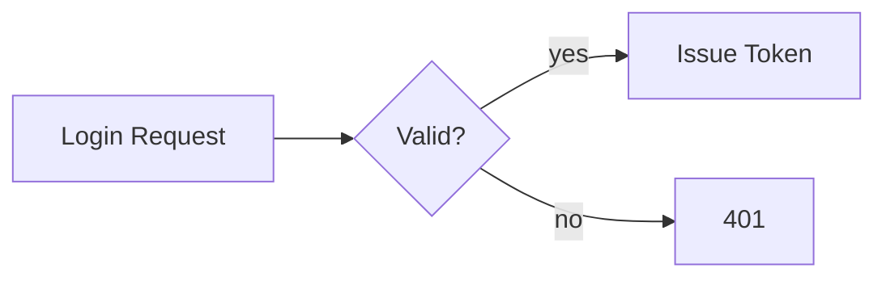

# Markdown Documentation Guidelines
Mandatory standards for Markdown authoring: syntax, structure, tables, code fences, Mermaid-first diagrams, front-matter, linting, and doc accessibility. CommonMark/GFM, markdownlint, Mermaid 11+, Vale, Prettier.

---
name: markdown
title: Markdown Documentation Guidelines
version: 2.0
last_reviewed: 2026-06-05
kind: cross-cutting
tools: [markdownlint-cli2, prettier@3, vale@3, mermaid@11, markdown-link-check, cspell]
requires: []
recommends:
  - comments
  - adr
provides:
  - markdown-syntax
  - markdown-linting
  - doc-structure
---

> 🧭 Authored per [`CONVENTIONS.md`](guides://CONVENTIONS.md): shared concerns are referenced, not restated. This guide owns Markdown authoring — syntax, structure, code fences, tables, diagrams, front-matter, doc linting, and doc accessibility.

---

## 0. Prerequisites & References

This guide canonically owns **Markdown authoring**. Other concerns are referenced, not duplicated.

> 📎 **RECOMMENDED — fetch when the task touches them:**
> - [`comments.md`](guides://comments.md) — code doc-comments / API-doc-from-source policy. *(Markdown owns prose docs; comments.md owns docstrings/JSDoc/TSDoc embedded in code.)*
> - [`adr.md`](guides://adr.md) — Architecture Decision Records. *(ADRs are Markdown files; their structure/lifecycle is owned by adr.md — write them per adr.md, format them per this guide.)*

> 📎 **SEE ALSO:**
> - [`accessibility.md`](guides://accessibility.md) — WCAG/screen-reader policy. *(This guide owns doc-specific a11y: alt text, heading order, link text, table headers; full WCAG rules live there.)*
> - [`ci-cd.md`](guides://ci-cd.md) · [`pre-commit.md`](guides://pre-commit.md) — where the doc-lint gates run. *(This guide owns the lint commands; pipeline/hook mechanics are owned there.)*
> - [`git.md`](guides://git.md) — commit conventions, branch naming, PR workflow. *(CONTRIBUTING/commit-message content belongs there, not restated here.)*
> - [`semver.md`](guides://semver.md) — versioning policy behind CHANGELOG entries.
> - [`openapi.md`](guides://openapi.md) · [`architectures.md`](guides://architectures.md) — API-spec docs and architecture-diagram semantics.

---

## 1. Core Philosophies: CLEAR-DOC

Markdown-authoring principles only. Code-doc policy (comments.md), WCAG (accessibility.md), and CI mechanics (ci-cd.md) come from §0.

- **C**onsistent — one marker per construct (`-` lists, `*` emphasis, ATX `#` headings, fenced code); enforced by markdownlint, not by hand.
- **L**inked & navigable — descriptive link text, working anchors, a ToC for docs > 3 sections.
- **E**xamples-first — show runnable, language-tagged code before abstract prose.
- **A**ccessible — single H1, no skipped heading levels, alt text on every image, table headers (doc-binding of accessibility.md).
- **R**eproducible — every code block is tested/runnable; diagrams render.
- **D**iagrams-as-code — Mermaid for all logical diagrams (versionable, diffable, native on GitHub/GitLab); never a static image where Mermaid can express it.
- **O**rganized — overview → detail (progressive disclosure); single source of truth, no copy-paste docs.
- **C**orrect — automated lint/link/spell/diagram validation in CI; untested docs are not delivered.

**Verified Docs**: Agent-authored Markdown MUST pass every gate in §2 before delivery.

---

## 2. Requirements (MANDATORY, auditable)

RFC-2119 keywords. IDs `MD-<TOPIC>-<NN>`. Each row has a binary gate; rows binding a shared rule cite its owner.

| ID | Requirement | Verify | Gate |
|----|-------------|--------|------|
| MD-LINT-01 | Markdown MUST lint clean | `markdownlint-cli2 "**/*.md"` | exit 0 |
| MD-FMT-01 | Markdown MUST be formatted | `prettier --check "**/*.md"` | no diff |
| MD-STRUCT-01 | Exactly one H1; no skipped heading levels | markdownlint MD025 + MD001 | exit 0 |
| MD-STRUCT-02 | Fenced code blocks MUST declare a lowercase language | markdownlint MD040 / review | exit 0 |
| MD-LINK-01 | No broken internal/external links or anchors | `markdown-link-check **/*.md` | 0 dead |
| MD-DOC-01 | A11y: every image has descriptive alt text; tables have headers; link text is descriptive (see `accessibility.md`) | markdownlint MD045 + review | exit 0 |
| MD-DIA-01 | Logical diagrams MUST be Mermaid (not images) and MUST render | `mmdc -i <file> -o /dev/null` | renders |
| MD-DIA-02 | Each diagram MUST have preceding context and stay within complexity limits (§3) | review | within limits |
| MD-SPELL-01 | Prose MUST pass spell check | `cspell "**/*.md"` | 0 unknown |
| MD-PROSE-01 | Prose SHOULD pass the style linter | `vale .` | 0 errors |

> **Forbidden**: bare ` ``` ` fences with no language; static images for logical diagrams; broken links; mixed list/emphasis markers; multiple H1s; skipped heading levels; restating commit/CI/WCAG rules owned by §0 guides.

---

## 3. Verification Protocol

Run before presenting docs. Fix → re-run until green.

```bash
markdownlint-cli2 "**/*.md"            # MD-LINT-01, MD-STRUCT-01/02, MD-DOC-01
prettier --check "**/*.md"             # MD-FMT-01
markdown-link-check **/*.md            # MD-LINK-01
cspell "**/*.md"                       # MD-SPELL-01
vale .                                 # MD-PROSE-01
# MD-DIA-01: validate every Mermaid block renders
grep -rl '```mermaid' --include='*.md' . | xargs -I{} mmdc -i {} -o /dev/null
```

The *why* (CI placement, hook wiring) lives in [`ci-cd.md`](guides://ci-cd.md) / [`pre-commit.md`](guides://pre-commit.md); this guide owns the commands and gates.

---

## 4. Markdown Syntax (owned)

### A. Headings
ATX only (`#`…`######`). One H1 = document title. Never skip levels (H2→H3→H4). Sentence case. Never the `===`/`---` setext underline style, never ALL-CAPS.

### B. Emphasis & inline
`*italic*`, `**bold**`, `***bold italic***`, `~~strikethrough~~`. Use asterisks (not underscores) consistently. Inline code in single backticks: `` `npm install` ``, `` `$HOME` ``.

### C. Links & images
```markdown
[descriptive text](https://example.com "optional title")
[ref style][id]            [id]: https://example.com

<https://example.com>      <!-- autolink; avoid bare URLs in prose -->
```
Link text MUST describe the target — never "here"/"click"/"link" (MD-DOC-01).

### D. Lists
- Unordered: `-` only (never mix `*`/`+`). Ordered: literal `1. 2. 3.`. Two-space nested indent, never tabs. Blank line before and after every list. Keep nesting ≤ 3 levels.
- **Task lists (GFM):** `- [ ]` / `- [x]`; may reference issues (`#123`). In an issue's first comment they drive a progress indicator and auto-check on close. *(GitHub's old `tasklist` fenced block was retired Feb 2025 — use plain task lists or sub-issues.)*

### E. Code blocks
GFM fences with a **lowercase language id** for highlighting (Linguist) — never a bare fence, never `~~~`, never 4-space indented blocks. A fenced block opens with ```` ```python ```` and closes with ```` ``` ````.
- Nest fences by wrapping in **quadruple** backticks when the content contains triple backticks.
- Inside ordered lists, fenced blocks take a 3-space indent; non-fenced sample text takes 8 spaces.
- `text` for plain output/logs, `diff` for `+/-` changes.
- GitHub-special fence ids render interactively: `mermaid` (diagrams), `geojson`/`topojson` (maps), `stl` (3D), `math` (LaTeX/MathJax).

### F. Tables
Pipe tables with a header row + separator. Align with `:`. Keep ≤ 6 columns; put code as inline `code`, never fenced blocks, inside cells. Use emoji status sparingly (✅ ❌ 🚧 ⚠️). Tables MUST have a header row (MD-DOC-01).
```markdown
| Left | Center | Right |
|:-----|:------:|------:|
| a    |   b    |     c |
```

### G. Blockquotes & alerts (GFM/GitLab)
`>` for quotes; avoid nesting beyond 2 levels. Callouts: `> [!NOTE]`, `> [!TIP]`, `> [!IMPORTANT]`, `> [!WARNING]`, `> [!CAUTION]` (each followed by a `>` content line). Docusaurus/MkDocs equivalents: `:::note … :::`, `:::tip`, `:::danger`.

### H. Horizontal rules & HTML
Rule: `---` (prefer over `***`/`___`). Use raw HTML only when Markdown cannot express it — `<details><summary>`, `<kbd>`, `<sub>`/`<sup>`, `<div align>`; always blank-line-pad HTML blocks, keep them semantic, avoid inline styles and deprecated tags.

---

## 5. Diagrams — Mermaid-First (owned)

Logical diagrams (architecture, flows, data models, sequences, state machines, timelines) MUST be Mermaid unless the user requests another format (PlantUML/D2/Graphviz). Mermaid is code: versionable, diffable, reviewable, native on GitHub/GitLab/Notion/Docusaurus/MkDocs. Use images only for screenshots/photos; GeoJSON/TopoJSON for maps; STL for 3D models. (For *architecture semantics* see [`architectures.md`](guides://architectures.md); this guide owns the diagram **authoring** rules.)

### A. Authoring rules (apply to every diagram)
- **IDs/labels:** camelCase descriptive IDs (`authService`, `userDB`) with human-readable labels (`[Auth Service]`); single letters only for ≤3-node trivial examples.
- **Edge labels:** describe the action/condition — `-->|on success|`, `-->|queries|`; sequence messages carry HTTP method/payload/signature.
- **Context:** every diagram MUST be preceded by a heading or sentence explaining it; gantt/timeline/xy charts MUST have a `title`.
- **Complexity limits (split if exceeded):** flowchart ≤ 20 nodes, sequence ≤ 8 participants, ER ≤ 15 entities, state ≤ 12 states; nest `subgraph` ≤ 2 levels, 2–8 nodes each, quoted titles `subgraph id["Title"]`.
- **Direction:** `LR` for pipelines/processes, `TB`/`TD` for hierarchies/architecture, `BT` only for dependency trees; be consistent within a doc.
- **Styling:** reusable `classDef` semantic classes (`primary`/`success`/`danger`/`storage`), never scattered `style`; always set `fill` **and** `color` for contrast (WCAG AA); never use color as the only differentiator (also use shape/label/position).
- Always use `stateDiagram-v2` (not legacy `stateDiagram`); use `[*]` for start/end and action-named transitions.

### B. Type quick-reference (GitHub-rendered)

| Type | Fence keyword | Use for |
|------|---------------|---------|
| Flowchart | `flowchart TB/LR` | architecture, processes, decision trees |
| Sequence | `sequenceDiagram` | API/service interactions (`->>` sync, `-->>` reply, `alt/loop/par`) |
| Class | `classDiagram` | object models (`+ - # ~`, `<\|--` inherit, `*--` compose) |
| ER | `erDiagram` | data models (`\|\|--o{`, `\|\|--\|{`) |
| State | `stateDiagram-v2` | lifecycles / state machines |
| Gantt | `gantt` | schedules (`done`/`active`/`crit`) |
| Git graph | `gitGraph` | branching strategy |
| Mindmap | `mindmap` | concept overviews |
| Timeline | `timeline` | history/milestones |
| Quadrant | `quadrantChart` | prioritization matrices |
| Sankey | `sankey-beta` | flow quantities |
| Block | `block-beta` | component layouts |
| Packet | `packet-beta` | protocol/data-structure layouts |
| XY chart | `xychart-beta` | inline metric bar/line charts |

Node shapes: `[rect]` `(rounded)` `([stadium])` `[[subroutine]]` `[(database)]` `((circle))` `{diamond}` `{{hexagon}}`. Maps: `geojson`/`topojson` fences (generate TopoJSON, don't hand-write; validate via geojson.io). 3D: ASCII `stl` fences only (binary STL won't render), keep < 1 MB.

---

## 6. Document Structure (owned)

Standard docs follow an overview→detail shape. Below are the canonical skeletons (fill, don't pad). Commit-message/branch/PR rules belong to [`git.md`](guides://git.md); versioning to [`semver.md`](guides://semver.md); ADRs to [`adr.md`](guides://adr.md) — link, don't restate.

### A. README
Title → one-line description → badges → key features → **Quick Start** (install + minimal runnable example) → Installation/Prerequisites → Usage → Configuration → Documentation links → Contributing (link to `CONTRIBUTING.md`) → License. Lead with the smallest working example; one H1 only.

### B. API reference
Per endpoint: HTTP signature in an ` ```http ` block, parameter/query tables (Name·Type·Required·Description), one request example (`curl`), one response example (`json`), and a shared status-code/error-format table. For full machine-readable specs use OpenAPI (see [`openapi.md`](guides://openapi.md)).

### C. Tutorial
"What you'll build" + time + difficulty + prerequisites (task-list) → numbered Step N sections, each with context → tested code block → expected output → Troubleshooting → Next steps. Every code block must run as written.

### D. CHANGELOG
Use [Keep a Changelog](https://keepachangelog.com) headings (`Added/Changed/Deprecated/Removed/Fixed/Security`) under reverse-chronological version sections, an `[Unreleased]` section, and compare-link references at the bottom. Version semantics are owned by [`semver.md`](guides://semver.md).

### E. CONTRIBUTING
Keep it thin: link to `CODE_OF_CONDUCT.md`, setup commands, and the test/lint gates. **Branch naming, commit-message format, and PR workflow are owned by [`git.md`](guides://git.md)** — link there instead of duplicating Conventional Commits tables.

---

## 7. Front-Matter & Metadata (owned)

YAML front-matter (`--- … ---` at the very top) drives static-site generators and SEO. Common keys:
```yaml
---
title: API Authentication Guide | Project Name   # used as <title>; keep descriptive
description: One-sentence summary for SEO and link previews.
keywords: [api, authentication, jwt]
author: Jane Doe
date: 2024-01-15
modified: 2024-01-20
canonical: https://docs.example.com/guides/api-auth
robots: index, follow
toc: true
---
```
- SEO: front-loaded primary keyword in the H1; descriptive H2/H3 for long-tail terms; meaningful internal links; Open Graph / `twitter:` meta (in HTML `<head>` or generator config) for social previews.
- One front-matter block per file; do not duplicate the H1 inside front-matter `title` and the body inconsistently.

---

## 8. Doc Accessibility (doc-binding of accessibility.md)

Full WCAG policy is owned by [`accessibility.md`](guides://accessibility.md). For Markdown specifically:
- **Headings:** proper hierarchy, never skipped — produces the screen-reader outline and the ToC.
- **Images:** descriptive alt text (``), empty `` only for purely decorative images; never embed text-as-image.
- **Links:** descriptive text (no "here"/"read more").
- **Tables:** always a header row; keep simple.
- **Code/lists:** introduce with a sentence of context before the block.
- **Color:** never the sole signal (mirror in shape/label/text); ensure contrast.

---

## 9. Tooling (owned)

The doc toolchain. Pipeline/hook *mechanics* are owned by [`ci-cd.md`](guides://ci-cd.md) / [`pre-commit.md`](guides://pre-commit.md); below are the configs/commands this guide owns.

**markdownlint** (`.markdownlint-cli2.yaml` or `.markdownlint.json`) — pin the constructs this guide mandates:
```jsonc
{
  "default": true,
  "MD003": { "style": "atx" },        // ATX headings
  "MD004": { "style": "dash" },       // - list marker
  "MD007": { "indent": 2 },
  "MD013": { "line_length": 120 },
  "MD025": true,                      // single H1
  "MD040": true,                      // fenced code must declare language
  "MD046": { "style": "fenced" },
  "MD049": { "style": "asterisk" },
  "MD050": { "style": "asterisk" },
  "MD033": false, "MD034": false      // allow inline HTML / bare URLs where needed
}
```
**Prettier** — `proseWrap: "always"`, `printWidth: 80` for `*.md`. **Vale** (`.vale.ini`, `BasedOnStyles = Vale, write-good`) for prose style. **cspell** (`.cspell.json`) for spelling with a project word list. **markdown-link-check** for links (`aliveStatusCodes` incl. 429, retry on 429). Validate diagrams with `@mermaid-js/mermaid-cli` (`mmdc`).

```bash
markdownlint-cli2 "**/*.md"                 # lint
prettier --write "**/*.md"                  # format
vale .                                       # prose style
cspell "**/*.md"                             # spelling
markdown-link-check **/*.md                  # links
```

Generators: **MkDocs** (`mkdocs-material`, `mermaid2` plugin, `--strict` build), **Docusaurus** (`@docusaurus/theme-mermaid`, `onBrokenLinks: 'throw'`), **VitePress** (built-in Mermaid + Shiki). All support Mermaid natively and a strict broken-link mode — enable it.

---

## 10. Anti-Patterns (NEVER)

- Static image for a logical diagram → use Mermaid.
- Bare ` ``` ` fence with no language; `~~~` fences; 4-space indented code.
- Bare URLs in prose; "click here" link text; text-as-image.
- Mixed markers (`*`+`-` lists, `__`+`**` bold); multiple H1s; skipped heading levels.
- Mega-diagrams (40+ nodes), diagrams with no preceding context, untitled gantt/xy/timeline charts, color as the only differentiator.
- Restating commit/CI/WCAG/semver rules owned by §0 — link instead.
- Vague instructions ("run the command") instead of the exact command and expected output.

---

## 11. Deployment Checklist

Generated from §2 — one box per requirement ID.

- [ ] MD-LINT-01 — `markdownlint-cli2` clean
- [ ] MD-FMT-01 — `prettier --check` no diff
- [ ] MD-STRUCT-01 — exactly one H1, no skipped heading levels
- [ ] MD-STRUCT-02 — every fenced block declares a lowercase language
- [ ] MD-LINK-01 — link checker: 0 broken links/anchors
- [ ] MD-DOC-01 — alt text on all images, table headers present, descriptive link text (see `accessibility.md`)
- [ ] MD-DIA-01 — all logical diagrams are Mermaid and render (`mmdc`)
- [ ] MD-DIA-02 — each diagram has context and stays within complexity limits
- [ ] MD-SPELL-01 — `cspell` clean
- [ ] MD-PROSE-01 — `vale` reports 0 errors
- [ ] Agent ran every §3 command and documented any fixes

---
**End of Markdown Documentation Guidelines**
